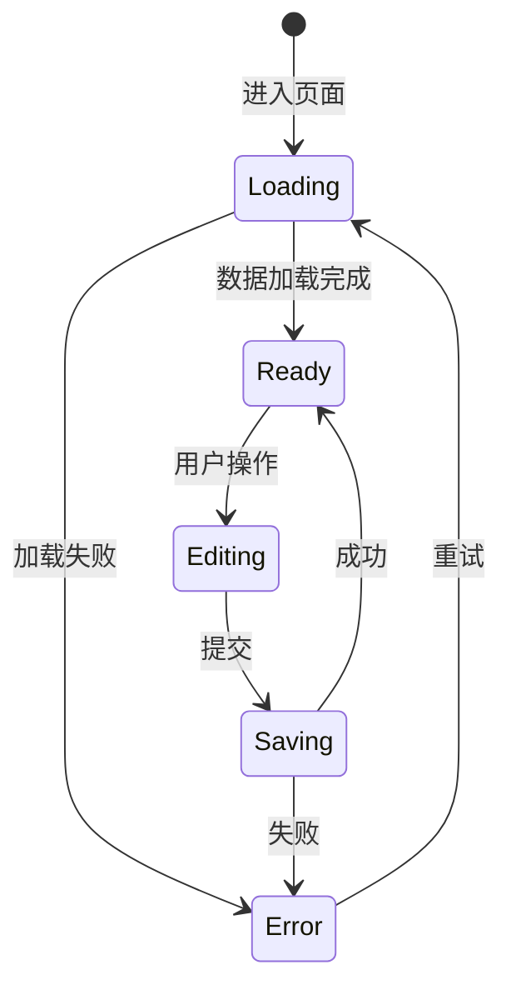

# 交互流程: {PageName}

> **导航**: [← 02-组件编排](./02-组件编排.md) · [↑ 00-索引](./00-索引.md) · [04-操作场景 →](./04-操作场景.md)
> | v{version} | {YYYY-MM-DD} | {模型} | 🌿 {branch} |

---

## §1 页面状态流

| 状态 | 含义 | UI 表现 |
|------|------|---------|
| Loading | {数据加载中} | {Skeleton / Spinner} |
| Ready | {就绪} | {正常内容} |
| Editing | {编辑中} | {表单激活} |
| Error | {错误} | {错误提示 + 重试} |

---

## §2 路由跳转

### 页面内跳转

| 触发 | 目标 | 携带参数 | 条件 |
|------|------|---------|------|
| {操作} | `{#anchor / tab}` | — | — |

### 跨页面跳转

| 触发 | 目标路由 | 携带参数 | 返回行为 |
|------|---------|---------|---------|
| {操作} | `{/target/path}` | `{params}` | {返回本页 / 不可返回} |

---

## §3 模态/抽屉/通知

| 类型 | 触发条件 | 内容 | 关闭行为 |
|------|---------|------|---------|
| {Modal / Drawer / Toast / Notification} | {用户操作 / 系统事件} | {内容描述} | {确认/取消/自动消失} |

---

## §4 表单交互

| 表单 | 字段 | 校验时机 | 提交方式 |
|------|------|---------|---------|
| `{formName}` | `{fields}` | {blur / submit / realtime} | {API 调用 / Store 更新} |

> 无表单时注明"无表单"。

---

## §5 错误与空态

| 场景 | 触发条件 | UI 表现 | 恢复操作 |
|------|---------|---------|---------|
| 数据为空 | {列表无数据 / 搜索无结果} | {空态插图 + 引导文案} | {创建入口 / 清除筛选} |
| 加载失败 | {网络错误 / 服务异常} | {错误提示} | {重试按钮} |
| 权限不足 | {无访问权限} | {403 页面 / 提示} | {申请权限 / 返回} |

> **导航**: [← 02-组件编排](./02-组件编排.md) · [04-操作场景 →](./04-操作场景.md)
