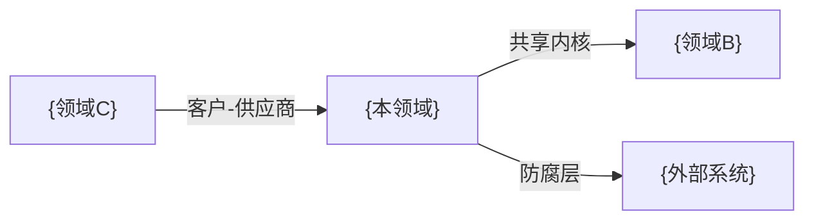

# 领域概述: {DomainName}

> **导航**: [← 00-索引](./00-索引.md) · [↑ 领域模型](../) · [02-实体模型 →](./02-实体模型.md)
> | v{version} | {YYYY-MM-DD} | {模型} | 🌿 {branch} |

---

## §1 领域边界

### 核心概念

| 概念 | 定义 | 示例 |
|------|------|------|
| {概念名} | {一句话定义} | {具体示例} |

### 范围内

- {此领域管理的内容}

### 范围外

- {明确不属于此领域的内容}

---

## §2 限界上下文

| 字段 | 值 |
|------|---|
| 上下文名称 | {BoundedContext} |
| 通用语言 | {此上下文内的术语表} |
| 团队归属 | {负责团队} |

---

## §3 上下文映射图

| 关系 | 上游 | 下游 | 类型 | 集成方式 |
|------|------|------|------|---------|
| {关系名} | {上游上下文} | {下游上下文} | {共享内核/客户-供应商/防腐层/开放主机} | {API/事件/共享库} |

---

## §4 上下游依赖

### 上游（本领域依赖的）

| 领域/系统 | 依赖内容 | 集成方式 | 失败影响 |
|----------|---------|---------|---------|
| {上游名} | {依赖什么} | {API/事件/共享库} | {降级/阻断} |

### 下游（依赖本领域的）

| 领域/系统 | 消费内容 | 集成方式 | 契约 |
|----------|---------|---------|------|
| {下游名} | {消费什么} | {API/事件} | {版本/兼容性} |

---

## §5 关联索引

- 实体模型: [02-实体模型.md](./02-实体模型.md)
- 领域服务: [03-领域服务.md](./03-领域服务.md)
- 操作场景: [04-操作场景.md](./04-操作场景.md)

> **导航**: [← 00-索引](./00-索引.md) · [02-实体模型 →](./02-实体模型.md)
