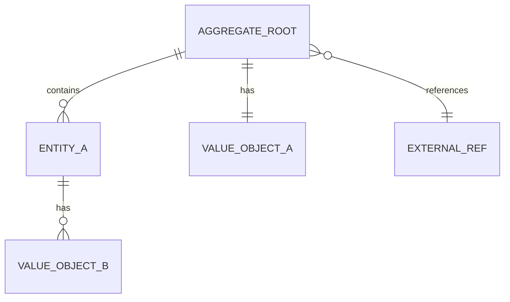

# 实体模型: {DomainName}

> **导航**: [← 01-领域概述](./01-领域概述.md) · [↑ 00-索引](./00-索引.md) · [03-领域服务 →](./03-领域服务.md)
> | v{version} | {YYYY-MM-DD} | {模型} | 🌿 {branch} |

---

## §1 实体清单

| 实体 | 类型 | 标识符 | 生命周期 | 文件路径 |
|------|------|--------|---------|---------|
| `{EntityName}` | {聚合根 / 实体 / 值对象} | `{id type}` | {创建→活跃→归档/删除} | `{path}` |

---

## §2 值对象

| 值对象 | 字段 | 不变式 |
|--------|------|--------|
| `{ValueObject}` | `{field1: Type, field2: Type}` | {约束条件} |

> 值对象无标识符，通过属性值相等判定。

---

## §3 聚合根

### {AggregateRootName}

**聚合边界**: {此聚合包含哪些实体和值对象}

**一致性规则**:
- {规则1: 聚合内强一致}
- {规则2: 跨聚合最终一致}

**不变式**:
- {不变式1: 业务约束}
- {不变式2: 数据完整性}

---

## §4 关联关系图

| 关系 | 源 | 目标 | 类型 | 说明 |
|------|---|------|------|------|
| {关系名} | `{Source}` | `{Target}` | {1:1 / 1:N / N:M / 引用} | {说明} |

---

## §5 持久化映射

| 实体/值对象 | 存储方式 | 表/集合 | 映射策略 |
|------------|---------|---------|---------|
| `{Entity}` | {关系型 / 文档 / KV} | `{table_name}` | {ORM / 手动映射} |

> **导航**: [← 01-领域概述](./01-领域概述.md) · [03-领域服务 →](./03-领域服务.md)
