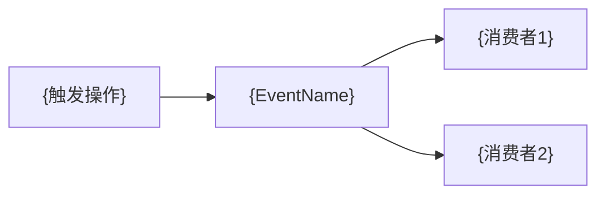

# 领域服务: {DomainName}

> **导航**: [← 02-实体模型](./02-实体模型.md) · [↑ 00-索引](./00-索引.md) · [04-操作场景 →](./04-操作场景.md)
> | v{version} | {YYYY-MM-DD} | {模型} | 🌿 {branch} |

---

## §1 领域服务清单

| 服务 | 职责 | 依赖 | 副作用 | 文件路径 |
|------|------|------|--------|---------|
| `{ServiceName}` | {一句话职责} | `{依赖的仓储/服务}` | {事件发布/外部调用/状态变更} | `{path}` |

---

## §2 领域事件

| 事件 | 触发条件 | 携带数据 | 消费者 |
|------|---------|---------|--------|
| `{EventName}` | {什么操作触发} | `{payload schema}` | {哪些服务/领域消费} |

---

## §3 仓储接口

| 聚合根 | 仓储 | 方法 | 说明 |
|--------|------|------|------|
| `{AggregateRoot}` | `{RepositoryName}` | `findById(id)` | {按 ID 查询} |
| | | `save(entity)` | {创建或更新} |
| | | `delete(id)` | {删除} |
| | | `{customQuery}` | {自定义查询} |

---

## §4 工厂

| 工厂 | 创建目标 | 参数 | 不变式校验 |
|------|---------|------|-----------|
| `{FactoryName}` | `{Entity/Aggregate}` | `{params}` | {创建时校验的规则} |

> 无工厂时注明"直接构造"。

---

## §5 领域规则

| # | 规则 | 类型 | 校验时机 | 违反后果 |
|---|------|------|---------|---------|
| 1 | {业务不变式} | {不变式 / 约束 / 前置条件} | {创建时 / 变更时 / 始终} | {拒绝操作 / 抛出异常} |
| 2 | {数据完整性} | {约束} | {持久化前} | {校验失败} |

> **导航**: [← 02-实体模型](./02-实体模型.md) · [04-操作场景 →](./04-操作场景.md)
