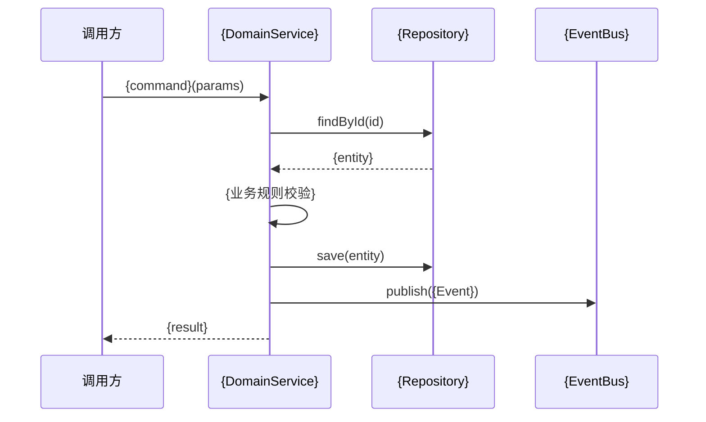
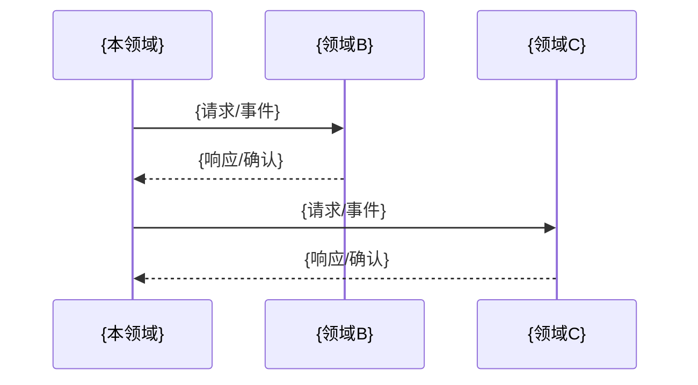

# 操作场景: {DomainName}

> **导航**: [← 03-领域服务](./03-领域服务.md) · [↑ 00-索引](./00-索引.md)
> | v{version} | {YYYY-MM-DD} | {模型} | 🌿 {branch} |

---

## §1 场景总览

| # | 场景名称 | 触发方 | 涉及聚合 | 涉及服务 |
|---|---------|--------|---------|---------|
| S1 | {场景名} | {用户/系统/定时/事件} | `{Aggregates}` | `{Services}` |
| S2 | {场景名} | {触发方} | `{Aggregates}` | `{Services}` |

---

## §2 领域内操作

### S1: {场景名称}

| Given | When | Then |
|-------|------|------|
| {领域状态：实体存在/状态为X} | {领域操作：调用服务/命令} | {状态变更 + 事件发布 + 返回值} |

**操作流程**:

---

## §3 跨领域协作

| 协作 | 本领域角色 | 对方领域 | 集成方式 | 一致性 |
|------|-----------|---------|---------|--------|
| {协作名} | {发起方/响应方} | {领域名} | {同步API/异步事件/Saga} | {强一致/最终一致} |

> 无跨域协作时注明"无跨领域协作"。

---

## §4 异常场景

| # | 场景 | Given | When | Then |
|---|------|-------|------|------|
| E1 | 业务规则违反 | {实体状态不满足前置条件} | {尝试操作} | {拒绝 + 错误码} |
| E2 | 并发冲突 | {同一聚合被并发修改} | {保存} | {乐观锁失败 + 重试} |
| E3 | 跨域补偿 | {下游领域处理失败} | {Saga 补偿} | {回滚本地变更 + 通知} |
| E4 | 最终一致性延迟 | {事件消费延迟} | {查询} | {返回旧数据 + 标注} |

> **导航**: [← 03-领域服务](./03-领域服务.md) · [↑ 00-索引](./00-索引.md)
