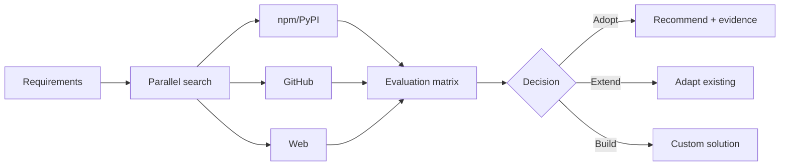

# search-first



## 用途

在做任何技术选型之前，先搜索。用真实数据支撑决策，避免凭记忆推荐过时或不存在的库。

## 输入

- **需求描述**：需要解决的技术问题（必填）
- **约束条件**：如语言/框架/许可证要求（可选）
- **搜索范围**：`npm` / `PyPI` / `GitHub` / `Web`（默认全部并行搜索）

## 工作流程

1. **需求拆解**：从描述中提取功能关键词和约束条件
2. **并行搜索**（同时发起）：
   - npm / PyPI：搜索包名、周下载量、最后更新
   - GitHub：搜索 stars、open issues、最后 commit
   - Web：搜索最新文档、已知问题、社区评价
3. **评估矩阵**：对每个候选方案打分

| 候选方案 | 功能覆盖 | 维护活跃度 | 社区规模 | 许可证 | 综合 |
|-----------|-------------------|----------------------|----------------|---------|---------|
| A         | ⭐⭐⭐⭐⭐          | ⭐⭐⭐⭐               | ⭐⭐⭐           | MIT     | ⭐⭐⭐⭐  |

4. **决策**：采用 / 扩展现有 / 组合 / 自研

## 输出格式

```
推荐方案：<方案名称>
依据：<2-3 句话基于搜索数据说明>
来源：<URL 或 package@version>

备选方案：<方案名称>（适用场景：<何时使用备选方案>）

搜索未覆盖：<无法通过搜索验证的部分，需人工确认>
```

## 使用规则

- 所有推荐必须有可验证来源（URL / 包名@版本）。
- 搜索结果与需求不符时，输出"未找到满足约束的方案"，**不猜测**。
- 若无网络访问权限，明确声明"无法执行搜索，以下为基于训练数据的参考（可能过时）。"
