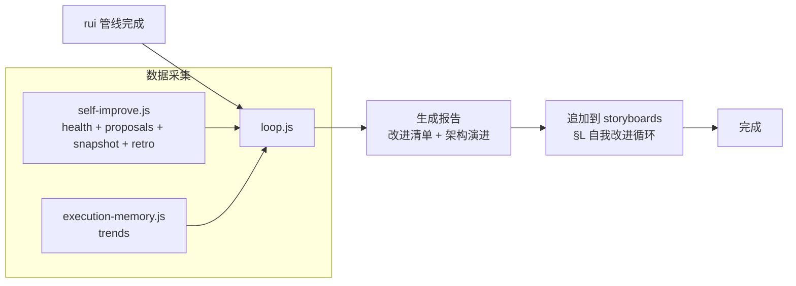
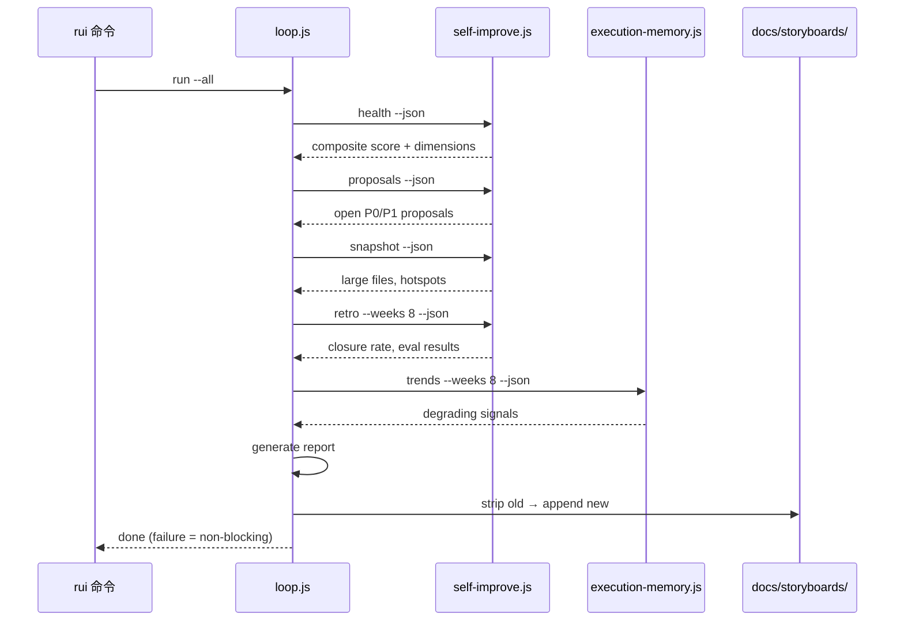
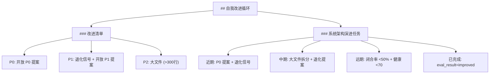

# self-improve-loop

多轮自我改进循环，分析项目健康度、检测退化信号，将可操作的改进清单和架构演进任务追加到故事板文档末尾。内建于 rui 所有命令。



---

## 触发

rui 所有命令完成后自动触发（C4 交付步骤 1）。失败不阻断主流程（降级：H11），跳过 loop 继续 import-docs → wework-bot。

| rui 命令 | 触发点 | 说明 |
|----------|--------|------|
| `/rui init` | 就绪检查后、C4 前 | S0→S5 已在 init 启动时运行，loop 在文档管线就绪后触发 |
| `/rui doc <name>` | D5 策展后、C4 前 | 单故事板完成 + git commit 后触发 |
| `/rui code <name>` | Gate B PASS 后、C4 前 | 代码验证通过后触发 |
| `/rui <name>` | Gate B PASS 后、C4 前 | 端到端（D0→D5 → C0→C3）完成后触发 |

> 内建的 S0→S5 自改进在管线不同阶段运行（init 启动时 S0→S5、D2/C0 时 S1、D5/C3 时 S2）。self-improve-loop 是 C4 步骤 1，采集 S0-S5 产出的所有数据，生成报告并追加到故事板。两者职责不同：S0-S5 采集和评估，self-improve-loop 汇总和呈现。

---

## 工作流



### 数据采集

| 数据源 | 脚本 | 产出 |
|--------|------|------|
| 健康评分 | `self-improve.js health --json` | composite + 六维评分 |
| 改进提案 | `self-improve.js proposals --json` | 开放 P0/P1 提案列表 |
| 代码快照 | `self-improve.js snapshot --json` | >300 行文件、依赖热点 |
| 趋势分析 | `execution-memory.js trends --weeks 8 --json` | 退化信号 |
| 回顾评估 | `self-improve.js retro --weeks 8 --json` | 闭合率、eval 结果 |

---

## 报告结构

两份产出追加到 `docs/storyboards/<name>.md` 末尾（以 `## 自我改进循环` 标记，对应模板 §L）：

> 与故事板模板 §6（.claude 改进清单）和 §7（系统架构演进任务）互补：§6 §7 是 pm 在文档生成阶段的结构性分析，self-improve-loop 提供数据驱动的运行时洞察。



### 改进清单

从开放提案、退化信号、大文件中提取可操作的改进项：

| 优先级 | 来源 | 示例 |
|--------|------|------|
| P0 | 开放 P0 提案 | 安全漏洞、数据丢失风险 |
| P1 | 退化信号 + 开放 P1 提案 | 某维度持续退化、架构漂移 |
| P2 | 大文件(>300行)、热点 | 内聚性风险、依赖耦合 |

### 系统架构演进任务

按时间维度规划演进路线：

| 时间 | 触发条件 | 来源 |
|------|---------|------|
| 近期 | 始终 | P0 提案 + 退化信号 |
| 中期 | largeFiles > 0 / degraded > 0 / hotspots > 0 | 大文件 + 退化提案 + 依赖热点 |
| 远期 | closureRate < 0.5 / composite < 70 | 闭合率 + 健康评分 |
| 已完成 | improved > 0 | eval_result=improved |

---

## 命令

```bash
# 追加到所有故事板（rui 默认调用）
node skills/rui/scripts/loop.js run --all

# 追加到单个故事板
node skills/rui/scripts/loop.js run --storyboard <path>

# 仅输出报告到 stdout
node skills/rui/scripts/loop.js report [--json]

# 查看运行历史
node skills/rui/scripts/loop.js status [--json]
```

---

## 去重

追加前先移除旧的 `## 自我改进循环` 章节（自该标记起至文件末尾），再追加最新报告，确保不会重复堆积。

---

## 与故事板模板的关系

| 章节 | 来源 | 性质 | 更新时机 |
|------|------|------|---------|
| §6 .claude 改进清单 | pm（模板后记） | 结构性分析 | D4/D5 文档生成时 |
| §7 系统架构演进任务 | pm（模板后记） | 结构性规划 | D3/D5 架构/策展时 |
| **§L 自我改进循环** | **self-improve-loop** | **数据驱动** | **每次 rui 完成时自动追加** |

§L 不会覆盖 §6 §7——loop 追加独立章节到文档末尾，与 pm 手工编写的内容互补。

## 集成

- **入口**: rui C4 交付步骤 1，所有命令（init/doc/code/full）完成后自动触发
- **脚本**: `skills/rui/scripts/loop.js`（主）、`self-improve.js`（数据采集）、`execution-memory.js`（趋势）
- **降级**: H11 — 采集/生成失败时跳过，不阻断后续 import-docs 和 wework-bot
