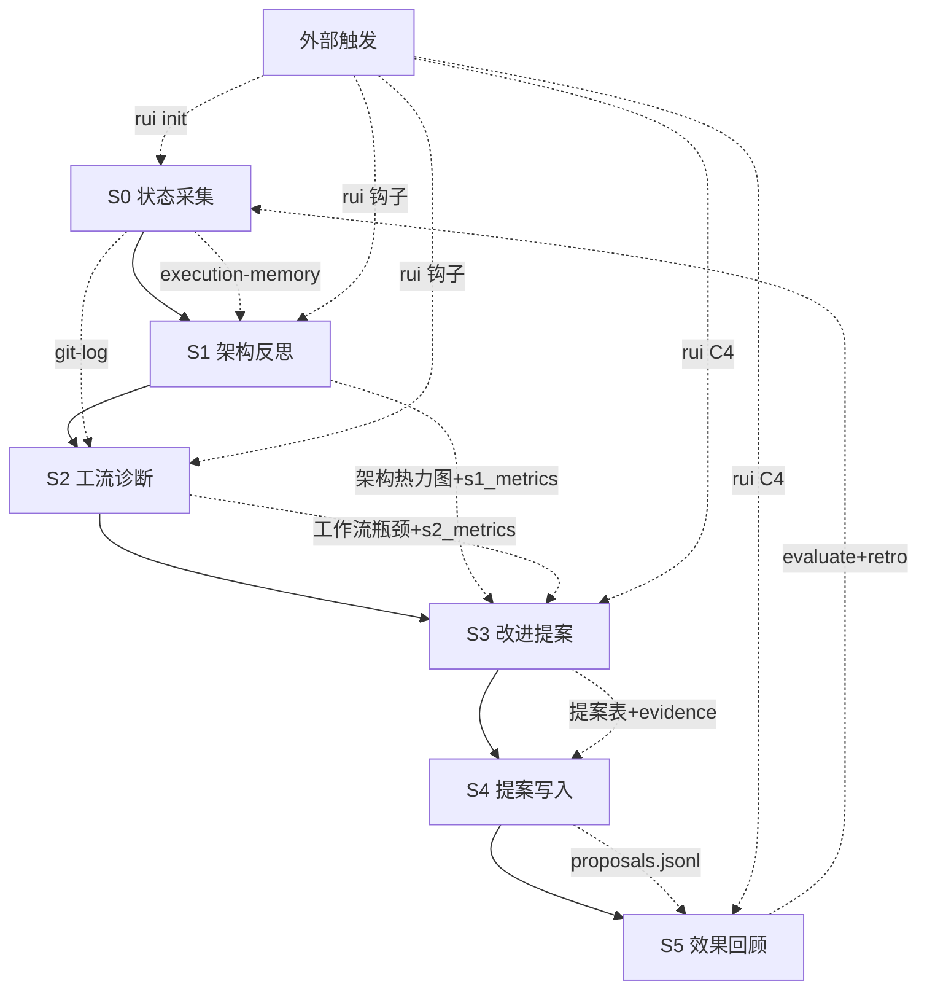

# self-improve



## 定位

项目自改进 skill：通过任务和项目分析来改进 `.claude/` 目录下的内容和项目架构演进。闭环"采集 → 反思 → 诊断 → 提案 → 写入 → 评估"全链路，驱动项目持续演进。

> **设计哲学**: 不是检查清单的罗列，而是从事实到判断的推理链。每个结论必须追溯到代码证据。

**核心职责**:
- 采集项目状态快照（代码结构、执行记忆、git 历史）
- 深度架构反思（耦合、内聚、演进方向、技术债、边界、UI 一致性）
- 工流诊断（阻塞频率、修复轮次、重复模式、阶段瓶颈）
- 改进提案生命周期管理（提出 → 解决 → 验证效果）
- 项目健康度评分和趋势追踪

**何时使用**:
- `/self-improve` — 全链路运行（S0→S5）
- `/self-improve snapshot` — 仅采集项目状态
- `/self-improve reflect` — 仅架构反思（S1）
- `/self-improve diagnose` — 仅工流诊断（S2）
- `/self-improve propose` — 仅改进提案（S3）
- `/self-improve evaluate` — 仅效果评估（S5）
- `/self-improve retro` — 回顾报告
- `/self-improve health` — 健康评分
- 被 rui 钩子自动触发（D2/C0 → S1, D5/C3 → S2, C4 → S3+S4+S5, init → S0→S5）

**何时不用**: 不涉及项目改进的纯执行任务；简单补丁、单文件小修。

## 命令

| 命令 | 阶段 | 描述 |
|------|------|------|
| `/self-improve` | S0→S5 | 全链路：采集 → 反思 → 诊断 → 提案 → 写入 → 评估 |
| `/self-improve snapshot` | S0 | 项目状态采集 |
| `/self-improve reflect` | S1 | 架构反思 |
| `/self-improve diagnose` | S2 | 工流诊断 |
| `/self-improve propose` | S3 | 改进提案 |
| `/self-improve evaluate` | S5 | 效果评估 |
| `/self-improve retro` | S5 | 回顾报告 |
| `/self-improve health` | S0 | 健康评分 |

**脚本命令**:

```
node .claude/skills/self-improve/scripts/self-improve.js snapshot [--json]
node .claude/skills/self-improve/scripts/self-improve.js proposals [--status open|done|superseded] [--json]
node .claude/skills/self-improve/scripts/self-improve.js resolve <id> [--resolved-by "<description>"]
node .claude/skills/self-improve/scripts/self-improve.js evaluate [--proposal <id>] [--since <date>] [--json]
node .claude/skills/self-improve/scripts/self-improve.js retro [--weeks <n>] [--json]
node .claude/skills/self-improve/scripts/self-improve.js health [--json]
node .claude/skills/self-improve/scripts/self-improve.js feedback <id> --rating <helpful|neutral|harmful> [--note "..."]
node .claude/skills/self-improve/scripts/execution-memory.js write <json-file>
node .claude/skills/self-improve/scripts/execution-memory.js query [--feature <name>] [--keyword <k>] [--limit <n>] [--json]
node .claude/skills/self-improve/scripts/execution-memory.js stats [--week <date>] [--json]
node .claude/skills/self-improve/scripts/execution-memory.js trends [--weeks <n>] [--json]
node .claude/skills/self-improve/scripts/execution-memory.js ls [--limit <n>] [--json]
```

---

## S0 状态采集

从四个数据源采集当前项目状态快照：

| 数据源 | 采集方式 | 关键产出 |
|--------|---------|---------|
| execution-memory | `execution-memory.js stats --json` | T1/T2/T3 分布、阻塞率、高频问题模式 |
| git 历史 | `git log --shortstat` + `git diff --stat` | 变更热力图：哪些文件/模块变更最频繁 |
| 代码库结构 | Glob + Grep 扫描 | 跨项目依赖矩阵、重复模式、孤儿文件 |
| UI 资产 | Glob+Grep Design Token/theme/组件库/图标/CSS | 设计系统基线 |

**变更热力图算法**:
1. `git log --since=<起止日> --shortstat` 统计每个文件的变更频次和行数
2. 按模块聚合（路由层/服务层/组件层/工具层），标注高频变更模块
3. 高频模块 = 演进热点，需要架构关注

**跨项目依赖矩阵**: 扫描所有 `import`/`from`/`require`/`fetch('/api/...')` 语句，构建 `{source → target}` 依赖图。依赖边数最多的节点 = 架构瓶颈候选。

**健康评分**: `self-improve.js health [--json]` — 5 维度 composite score（0-100）：

| 维度 | 权重 | 数据源 | 满分条件 |
|------|------|--------|---------|
| 变更稳定性 | 20% | execution-memory T1 占比 | T1>70% |
| 质量健康度 | 25% | execution-memory P0 率 | P0=0 |
| 阻塞率 | 20% | execution-memory blocked 率 | blocked=0 |
| 提案闭环率 | 20% | proposals done/(open+done) | 全部 done |
| 内聚健康度 | 15% | 大文件扫描 | 无 >300 行文件 |

评分存入 `docs/.improvement/.last-health.json` 用于趋势对比。

---

## S1 架构反思

基于当前阶段产出（影响链/代码变更/文档结构），深度推演架构演进方向。

**六维反思框架**:

| 维度 | 核心问题 | 推理方法 |
|------|---------|---------|
| 耦合度 | 哪些模块被最多其他模块依赖？ | 扇入>5 的模块是耦合热点 |
| 内聚性 | 一个模块是否只做一件事？ | 行数>300 或 export>10 的文件是内聚性风险 |
| 演进方向 | 高频变更模块朝稳定还是堆叠补丁演进？ | T1>70% = 稳态；T3>30% = 架构漂移 |
| 技术债热点 | 哪些区域变更频次最高但质量最低？ | 变更热力图 × P0 率 |
| 边界完整性 | 跨项目依赖是否都有明确契约？ | 缺失类型定义或注释的端点 = 契约缺失 |
| UI 一致性 | UI 组件是否遵循统一设计规范？ | 硬编码样式占比 >20% = 设计漂移 |

**产出**: 架构反思报告 — 每个发现必须包含 `证据` + `推断` + `建议方向`，三段式。

**结构化摘要 `s1_metrics`**:

```json
{
  "coupling_hotspots": 3,
  "cohesion_risks": 1,
  "boundary_gaps": 2,
  "tech_debt_hotspots": 0
}
```

- `coupling_hotspots`: 扇入>5 的模块数
- `cohesion_risks`: 行数>300 或 export>10 的文件数
- `boundary_gaps`: 契约缺失的跨项目依赖数
- `tech_debt_hotspots`: 高频变更 + P0 率高的区域数

`s1_metrics` 写入对应 proposal 的 `evidence` 和 `s1_metrics` 字段，用于跨次对比趋势。

---

## S2 工流诊断

分析工作流的效率和质量，找出可优化的流程节点。

**诊断维度**:

| 维度 | 诊断方法 | 判定标准 |
|------|---------|---------|
| 阻塞频率 | execution-memory `was_blocked` 统计 | 单一阻塞原因出现>2次 = 流程缺陷 |
| 修复轮次 | P0 修复平均轮次 | 平均>2轮 = 测试/审查不充分 |
| 重复模式 | 高频 `bad_cases` lesson 归类 | 同一 lesson 出现>2次 = 规则缺失 |
| 阶段耗时 | 各阶段实际耗时 | 某阶段占比>40% = 瓶颈候选 |
| 人工干预 | 用户中断/修正频率 | 中断>3次/会话 = 自动化不足 |

**产出**: 工作流瓶颈清单 — 每项标注 `现象` + `根因推断` + `优化方案`。

**结构化摘要 `s2_metrics`**:

```json
{
  "blocked_rate": 0.2,
  "avg_p0_rounds": 1.5,
  "repeat_patterns": 1,
  "stage_bottleneck": "C2"
}
```

- `blocked_rate`: 阻塞率
- `avg_p0_rounds`: P0 修复平均轮次
- `repeat_patterns`: 重复出现>2次的 bad_case lesson 数
- `stage_bottleneck`: 耗时占比最高的阶段 ID

`s2_metrics` 写入对应 proposal 的 `evidence` 和 `s2_metrics` 字段。趋势分析：`execution-memory.js trends [--weeks <n>] [--json]`。

---

## S3 改进提案

将 S1 架构反思 + S2 工流诊断合并为可执行的改进提案。

**提案格式**:

```markdown
### [P0/P1/P2] <提案标题>

- **类型**: 架构演进 / 工作流优化 / 规则补全 / 技术债清理
- **触发操作**: init / document / code / full / self-improve
- **问题来源**: S1/S2 具体发现（附证据路径）
- **当前状态**: 现状和痛点
- **目标状态**: 期望的改进后状态
- **实施路径**: 分步操作（每步可独立验证）
- **验证方法**: 改进后如何确认生效
- **风险与回退**: 失败后果和回退方案
- **时间维度**: 下次 init / 下周 / 下月
```

**优先级判定**:
- **P0**: 架构漂移（T3>30%）或工作流系统性阻塞
- **P1**: 技术债热点或重复模式未闭环
- **P2**: 内聚性风险或边界完善

**约束**: 每次反思最多 3 个发现，合并最多 5 条提案。P0 必须包含实施路径。

**证据关联**: 每个提案必须包含 `evidence`（可验证证据路径或 S1/S2 摘要）和 `related_bad_cases`（关联 bad case 列表）。

---

## S4 提案写入

将 S3 提案持久化到两个位置：

1. **文档后记**: 写入故事板后记的"架构演进思考"章节
2. **改进提案文件**: 写入 `docs/.improvement/proposals.jsonl`（append-only）

**`proposals.jsonl` 格式**:

```json
{
  "id": "<timestamp>-<hash>",
  "date": "YYYY-MM-DD",
  "trigger_op": "init|document|code|full|self-improve",
  "priority": "P0|P1|P2",
  "type": "architecture|workflow|rule|tech-debt",
  "title": "...",
  "problem_source": "...",
  "current_state": "...",
  "target_state": "...",
  "steps": ["step1", "step2"],
  "validation": "...",
  "risk_and_rollback": "...",
  "time_horizon": "next-init|next-week|next-month",
  "status": "open|done|superseded",
  "evidence": "证据路径或 S1/S2 摘要",
  "s1_metrics": { "coupling_hotspots": 3, "cohesion_risks": 1, "boundary_gaps": 2, "tech_debt_hotspots": 0 },
  "s2_metrics": { "blocked_rate": 0.2, "avg_p0_rounds": 1.5, "repeat_patterns": 1, "stage_bottleneck": "C2" },
  "related_bad_cases": ["agent::lesson"],
  "resolved_by": "解决方式描述",
  "eval_result": "improved|neutral|degraded|pending|null",
  "eval_date": "YYYY-MM-DD",
  "feedback": [{ "rating": "helpful|neutral|harmful", "note": "...", "date": "..." }]
}
```

**旧提案回顾**: 每次进入 S1 或 S2 前，读取 `status=open` 旧提案，验证是否已解决。已解决的标记 `status=done`（附 `resolved_by`），过时的标记 `status=superseded`。

**resolve 增强**: 标记提案为 done 时必须指定 `resolved_by`，自动设置 `eval_result=pending`。

**用户反馈**: `self-improve.js feedback <id> --rating <helpful|neutral|harmful> [--note "..."]` — 记录对提案的主观评价。

---

## S5 效果回顾

评估已解决提案的实际效果，闭环"提出→解决→验证"全链路。

**触发时机**:
- **全链路运行**: S0→S4 完成后自动执行 evaluate + retro
- **rui C4 交付**: 交付时自动执行 evaluate

**evaluate — 提案效果评估**:

```
node scripts/self-improve.js evaluate [--proposal <id>] [--since <date>] [--json]
```

逻辑：
1. 读取 `status=done` 的提案
2. 取 `resolvedDate` 前后 4 周的 execution-memory 数据
3. 计算：blocked 率变化、P0 率变化、related_bad_cases 消失情况
4. 判定 verdict: improved / neutral / degraded / insufficient_data
5. 置信度：high（≥5 条记录）、medium（3-4 条）、low（<3 条）
6. 评估结果写回 `proposals.jsonl` 的 `eval_result` + `eval_date`

**retro — 回顾报告**:

```
node scripts/self-improve.js retro [--weeks <n>] [--json]
```

产出：
- 按 2 周窗口的趋势（blocked_rate、p0_rate、T 分布）
- 提案闭环率（done / (open+done)）
- 评估结果分布（improved/neutral/degraded）
- 用户反馈汇总
- 待关注项：恶化的维度 + 未闭环的 P0 提案

**回顾报告去向**: 追加到文档后记"效果回顾"章节。

---

## 约束

- 反思不阻断主流程（rui init 全量运行时是前置执行，但不阻断后续文档/代码管线）
- 每次反思最多 3 个发现（防止噪音），合并最多 5 条提案
- 每个改进提案必须从代码证据推导，不凭空产生
- 每次操作必须回顾旧提案状态
- S1/S2 必须产出结构化摘要指标（`s1_metrics`/`s2_metrics`）
- S5 自动评估已解决提案的实际效果
- `proposals.jsonl` 存储路径: `docs/.improvement/proposals.jsonl`
- execution-memory 存储路径: `docs/.memory/execution-memory.jsonl`
- 健康评分缓存: `docs/.improvement/.last-health.json`

## 支持文件

- `scripts/self-improve.js` — 状态采集、提案管理、效果评估、健康评分、反馈
- `scripts/execution-memory.js` — 执行记忆读写、查询、统计、趋势
- `scripts/natural-week.js` — 自然周计算工具