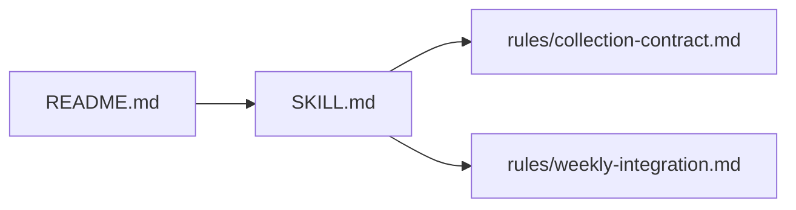

# self-improving

```mermaid
graph LR
    A[README.md] --> B[SKILL.md]
    B --> C[rules/collection-contract.md]
    B --> D[rules/weekly-integration.md]
```

行为真源：[SKILL.md](./SKILL.md)

本文件仅供目录发现。所有命令、收集规则请阅读 SKILL.md。
