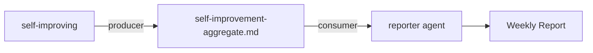

---
paths:
  - "skills/self-improving/rules/weekly-integration.md"
  - "docs/weekly/**/*.md"
---

# 周度集成



> 定义 `self-improving` 如何将整合后的性能情报输入周报，以及 `self-improving` 与 `reporter` agent 之间的契约。

## 1. 生产者/消费者划分

| 角色 | Skill / Agent | 职责 |
|------|---------------|----------------|
| 生产者 | `self-improving` | 提取、规范化并聚合单文档反思章节。 |
| 消费者 | `reporter` | 解读聚合数据、确定优先级并编写周报工作流审查和架构演进章节。 |

`reporter` 不得编造反思数据。若 `self-improvement-aggregate.md` 缺失或为空，reporter 写"本周未收集到反思数据"并继续。

## 2. 聚合输出格式

`self-improving weekly` 产出：

```
docs/weekly/<YYYY-MM-DD~YYYY-MM-DD>/self-improvement-aggregate.md
```

### 2.1 文件结构

```markdown
# Self-Improvement Aggregate (<week-range>)

> 由 `self-improving` 生成 — 请勿手动编辑。

## Workflow Standardization Review Summary

### Per-Feature Table

| Feature | Doc | Q1 | Q2 | Q3 | Q4 |
|---------|-----|----|----|----|----|
| ... | ... | ... | ... | ... | ... |

### Cross-Feature Patterns

- **重复手工操作**：列出功能与操作
- **缺失的决策标准**：列出反复出现的模糊决策
- **信息孤岛**：列出跨多个功能的孤岛
- **反馈闭环缺口**：列出缺少明确负责人/验收的功能

## System Architecture Evolution Thinking Summary

### Per-Feature Table

| Feature | Doc | A1 Bottleneck | A2 Evolution Node | A3 Risk & Rollback |
|---------|-----|---------------|-------------------|--------------------|
| ... | ... | ... | ... | ... |

### Cross-Feature Patterns

- **共享瓶颈**：按瓶颈类型分组功能
- **常见演进节点**：突出重复出现的架构提案
- **风险聚集**：标记出现在 ≥2 个功能中的高风险模式

## Data Quality

- 已扫描文档总数：N
- 缺失章节的文档数：N
- 覆盖率：N%
```

## 3. 周报中的集成点

### 3.1 工作流标准化复盘

`reporter` agent 从聚合中读取**跨功能模式**并产出四项回顾。必须：

1. 使用聚合计数（如"5 个功能中 3 个报告了重复手工操作"）。
2. 引用具体功能作为证据（如"`user-login` 和 `order-checkout` 均报告了模糊边界决策"）。
3. 将发现映射到具体的规则/检查清单/文件路径以驱动改进。

### 3.2 系统架构演进思考

`reporter` agent 从聚合中读取**按功能表格**和**跨功能模式**。必须：

1. 列出本周出现于 ≥1 个功能交付中的架构瓶颈。
2. 提出下一个演进节点，引用聚合中的证据。
3. 包含从聚合中复制或总结的风险与回滚方案。

## 4. 时序与编排

在 `build-feature`（document mode）`weekly` 命令工作流中：

1. **在** reporter 生成周报之前，编排器必须运行：
   ```bash
   node skills/self-improving/scripts/collect-self-improvement.js --week <week-start>
   ```
2. 脚本写入 `self-improvement-aggregate.md`。
3. `reporter` agent 将聚合路径作为其上下文的一部分接收（如通过文件读取）。
4. 若脚本失败，reporter 回退为"聚合不可用"并继续，不阻断。

## 5. 向后兼容

- 现有的 `self-improve.js`（基于执行记忆）在 `weekly` 命令阶段 6 之后继续运行，产出 `self-improve-proposal.md`（路径：`skills/build-feature/scripts/self-improve.js`）。其输出作为独立章节（"系统自我改进建议"）追加到周报中。
- 新的 `self-improving` 聚合是一个**独立的**输入流，专注于单文档反思而非执行记忆统计。两者可在周报中共存。
