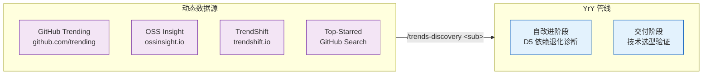
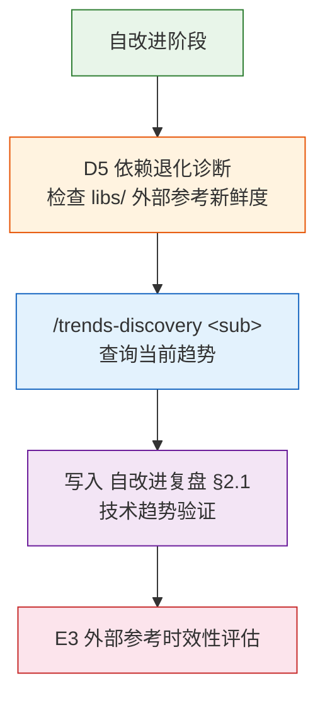

# trends-discovery

> **--help / -h**：执行 `node skills/trends-discovery/help.mjs` 输出完整帮助（含场景示例）。用户输入 `/trends-discovery --help` 或 `/trends-discovery -h` 或 `/trends-discovery help` 时，跳过查询逻辑，直接运行脚本并将输出展示给用户。

技术趋势发现。查询 GitHub Trending、OSS Insight、TrendShift、Top-Starred 四个数据源，输出结构化趋势报告。本技能为规约驱动（specification-only），由 implementing agent 执行 WebFetch + 结构化提取 + 格式化输出。

## 数据源全景



## 调用形态

| 输入 | 行为 | 场景 |
|------|------|------|
| `/trends-discovery` 或 `/trends-discovery status` | 状态检查：各数据源可达性 + 最近查询时间 | 探活 |
| `/trends-discovery github-trending [--lang <L>] [--since daily\|weekly]` | 查询 GitHub Trending 当前榜单 | D5 诊断 · 新兴工具发现 |
| `/trends-discovery oss-insight [--metric stars\|forks\|contributors] [--limit N]` | 查询 OSS Insight 仓库排名 | 技术选型数据支撑 |
| `/trends-discovery trendshift [--range 7\|30\|90]` | 查询 TrendShift 趋势变化 | 识别快速上升项目 |
| `/trends-discovery top-starred [--min-stars N]` | 查询 GitHub 高星项目 | 社区验证参照 |
| `/trends-discovery all` | 依次查询全部四个数据源 | 全面趋势扫描 |

## 各子命令工作流

### github-trending

```
步骤 1: WebFetch https://github.com/trending(?since=daily|weekly&language=<L>)
步骤 2: 提取仓库名、描述、语言、今日/本周 star 数、总 star 数
步骤 3: 格式化为表格输出，标注趋势方向（↑ 上升 / ↓ 下降 / → 持平）
步骤 4: 附带来源 URL 和时间戳
```

### oss-insight

```
步骤 1: WebFetch https://ossinsight.io/ + 具体集合页面
步骤 2: 提取仓库排名、指标数据
步骤 3: 格式化为表格输出
步骤 4: 若页面为 JS 渲染无法提取，降级为引导用户直接访问
```

### trendshift

```
步骤 1: WebFetch https://trendshift.io/github-trending-repositories?trending-range=<N>
步骤 2: 提取趋势变化数据（star 增长量/率、排名变化）
步骤 3: 格式化为表格输出，标注快速上升/下降项目
步骤 4: 附带来源 URL
```

### top-starred

```
步骤 1: WebFetch https://github.com/search?q=stars:><N>&type=repositories&s=stars&o=desc
步骤 2: 提取仓库名、描述、语言、star 数
步骤 3: 格式化为表格输出
步骤 4: 附带来源 URL
```

## 输出格式规约

```markdown
## trends-discovery 报告 — {YYYY-MM-DD HH:MM}

> 数据源：{source_name} | URL：{url} | 查询时间：{timestamp}

| 排名 | 仓库 | Stars | 语言 | 趋势 | 描述 |
|------|------|-------|------|------|------|
| 1 | owner/repo | ⭐ N.Nk | TypeScript | ↑ +500/d | Short description |

### 关键发现
- {finding 1}
- {finding 2}

### 与 YrY 的关联
- {relevance point}
```

## 自改进集成



| 管线节点 | 触发条件 | 输出位置 |
|---------|---------|---------|
| D5 依赖退化诊断 | `rui update` 或自改进阶段 | `{project}-自改进复盘.md` §2.1 |
| 交付阶段技术选型 | `/rui code` 完成 | 选型依据附加到实施报告 |

## 降级策略

| 情况 | 降级行为 |
|------|---------|
| WebFetch 不可用（网络限制） | 输出 URL 引导用户手动访问，标注 `无网络访问` |
| 页面 JS 渲染无法提取 | 输出页面 title + meta description，标注 `内容为 JS 渲染，需手动访问` |
| API 限速 | 间隔 5s 重试，最多 2 次；仍失败则输出上次缓存 |
| 数据源完全不可达 | 输出 `数据源不可达，参见 libs/trends.md 手动查阅` |

## 数据新鲜度

趋势数据为实时动态内容，**不缓存到本地文件**。每次查询实时获取。如需持久化趋势快照，由调用方（自改进 Agent）决定是否写入 `{project}-自改进复盘.md`。
