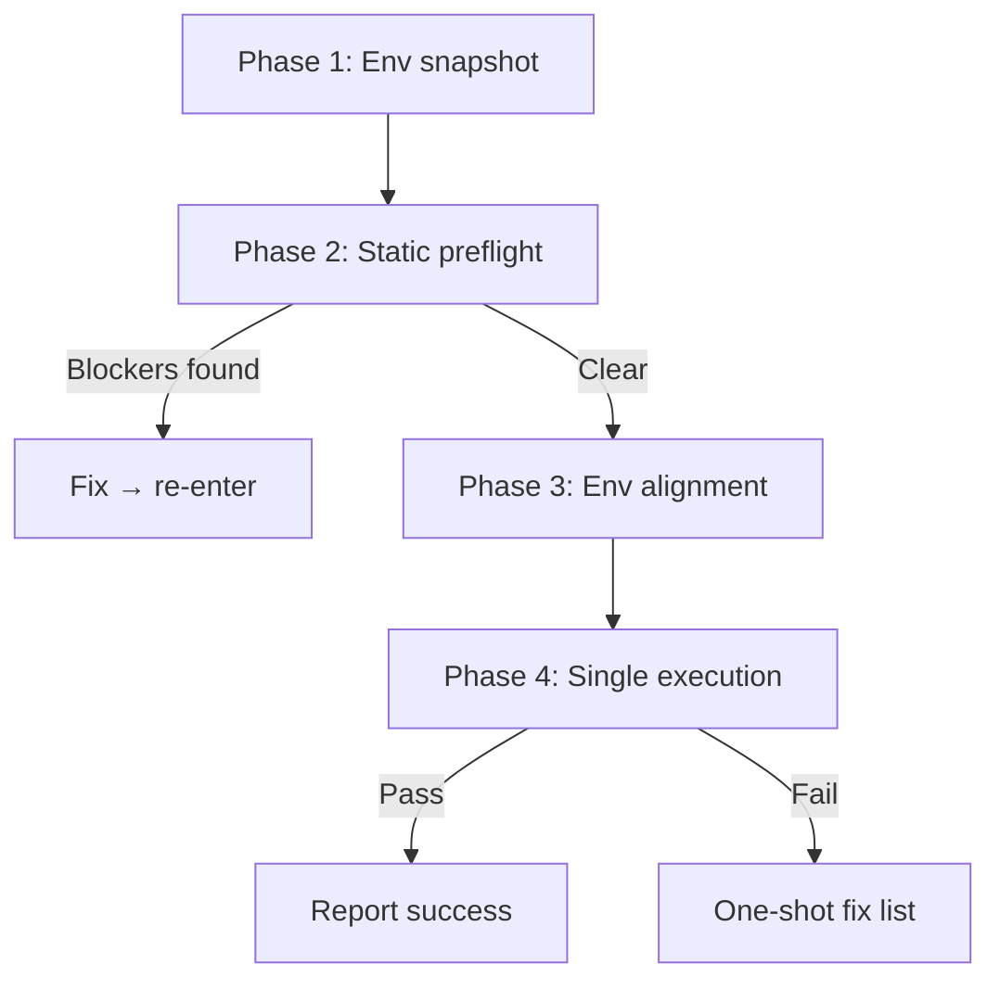

# verification-loop



## 核心理念

**依赖准备，而非重试。**在执行验证命令之前，识别所有可能导致失败的问题并修复；执行是最终确认，而非调试入口。

## 输入

- **验证目标**：如 `npm run build`、`Vite 打包`（必填）
- **故事范围**：`--story <name>` 按故事验证该故事 AC 表（可选，不指定则验证全部）
- **上下文文档**：`docs/<feature-name>.md` 路径（可选，默认自动定位）
- **环境信息**：Node 版本、包管理器（可选，自动读取）

## 工作流程（4 个阶段，顺序执行）

### 阶段 1：环境快照（不执行命令）

静态读取 `package.json`（脚本名称、依赖版本）、构建配置（vite/tsconfig/eslint）、`.nvmrc`、设计文档约束。

**阻断**：`package.json` 不存在或目标脚本不存在 → 停止

### 阶段 2：静态预检（不执行构建）

| 预检项 | 常见失败原因 |
|-----------------|----------------------|
| 依赖完整性 | 缺失依赖包、版本不匹配 |
| TypeScript 类型 | 类型不兼容、缺失声明文件 |
| Import 路径 | 路径拼写错误、文件已删除 |
| 环境变量 | 缺失必需变量 |
| Lint 规则 | 格式错误、未使用变量 |
| 已知约束 | 设计文档约定未实现 |

**阻断**：发现阻断项（如 import 路径不存在）→ 先修复，再进入阶段 3

### 阶段 3：环境对齐确认

当前 Node 版本满足 `engines.node` / `.nvmrc`；包管理器一致。

**阻断**：不对齐 → 给出对齐命令，等待执行后再继续

### 阶段 4：一次执行 + 结果断言

所有预检通过后，执行验证命令，**仅一次**：

| 验证项 | 通过条件 |
|-------------------|---------------|
| 依赖安装 | 退出码 0，无 peer dep 错误 |
| 类型检查 | 退出码 0 |
| Lint | 退出码 0 |
| 构建 | 退出码 0，输出目录非空 |
| P0 单元测试 | 退出码 0 |
| UI/E2E | 等效可脚本化自动化已执行，所有 P0 项通过 |

执行失败：不重试 → 解析错误输出 → 给出"一次性修复清单"（根因 + 操作 + 重新进入阶段）

## 故事级验证

当 `--story <name>` 指定时，验证聚焦于该故事的 AC 表：

1. 从 `docs/<feature-name>.md` §2 定位目标故事
2. 读取该故事的 `N.M.4 Acceptance Criteria` 表
3. 逐 AC 执行验证方法，记录实际结果
4. 输出故事验证报告：`AC# / Criterion / Expected / Actual / Status`

### 故事验证报告格式

```
Story: <story-title> [P0/P1/P2]
| AC# | Criterion | Test Method | Expected | Actual | Status |
|-----|-----------|-------------|----------|--------|--------|
| AC1 | ...       | cmd/op      | ...      | ...    | ✅/❌   |

Summary: N/M AC passed
```

## 使用规则

- 阶段 1-3 有阻断项禁止进入阶段 4
- 验证命令名必须取自 `package.json` scripts，不得硬编码
- 命令不存在时，输出"脚本 <名称> 不存在，跳过"
- 阶段 4 失败不自动重试；给出修复清单供调用方决策
- 自动化降级须标注 ⚠️，不得作为完全通过呈现
- 故事验证结果可写入对应故事 AC 表 Status 列
