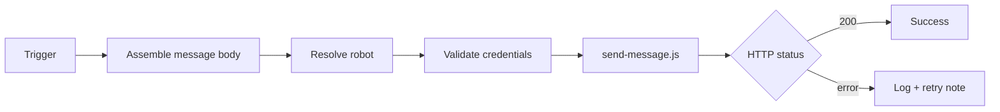

# wework-bot



## 定位

企业微信机器人通知 skill：将阶段状态、阻断原因和验证结果推送到企业微信群机器人，支持按 agent 路由到不同机器人。

## 项目集成

wework-bot 是 **YrY** 项目交付管线的最后一环，强制在 `rui` 编排器完成/阻断/门禁失败时触发。

### 在 rui 管线中的位置

```
rui 管线完成 → 自改进 → wework-bot 追加日志 → import-docs → wework-bot 发送
              ↑                        ↑                        ↑
          --no-send              文档同步前              文档同步后
```

### 触发关系

| 触发方 | 场景 | 通知内容 |
|--------|------|---------|
| `rui` 编排器 | 全流程完成 | 完成通知（含耗时、agent 用量、产出文件） |
| `rui` 编排器 | 阻断 | 阻断通知（含阻断原因、恢复点） |
| `rui` 编排器 | 门禁失败 | 门禁失败通知（含门禁名、实际结果） |
| `rui` 编排器 | 会话中断 | 中断通知（含中断原因、恢复点） |
| 用户直接调用 | 自定义消息 | 自由格式 |

### Agent 路由

当前 config 将所有 `rui` agent 路由到 `general` 机器人。扩展时在 `config.json` 的 `agents` 字段新增映射即可。

## 何时使用

- 用户请求向企业微信群/机器人发送信息
- 长流程需要外部可观测性（阶段状态/阻断/门禁失败/验证结论）
- **流水线强制步骤**：`rui` 完成/阻断/门禁失败必须通知，顺序：自改进 → `import-docs` → `wework-bot`
- 不触发的情况：用户仅写草稿但明确不发送；目标是同步文档（使用 `import-docs`）

## 输入

| 参数 | 描述 |
|-----------|-------------|
| `API_X_TOKEN` | 必填，仅从系统环境变量读取 |
| `WEWORK_BOT_WEBHOOK_URL` | 必填，企业微信 Webhook 完整 URL（含 key），仅从系统环境变量读取 |
| `WEWORK_BOT_API_URL` | 可选，覆盖默认 API |
| `WEWORK_BOT_CONFIG` | 可选，路由 JSON 路径（默认为仓库内 `config.json`） |
| `--agent` | 通过 `config.agents` 映射到机器人（推荐） |
| `--robot` | 直接指定机器人名称（极少使用） |
| `--name` / `-n` | 故事名称，发送前追加消息到 `docs/故事任务面板/<name>/09-消息通知列表.md` |
| `--content` / `-c` | 完整正文字符串 |
| `--content-file` / `-f` | 从 UTF-8 文件读取正文（长文案推荐） |
| `--no-send` | 仅追加消息到日志，不实际发送（交付步骤 1 用） |

Webhook 仅在 `config.json` 中配置，无 CLI 参数。

## 工作流程

1. 组装消息：按电梯演讲和契约编写完整正文
2. 选择机器人：`config.json` 通过 `--agent` 或 `--robot` 解析 webhook；未指定时使用 `default_robot`
3. 验证凭据：`API_X_TOKEN` + 来自 config 的 webhook（`--no-send` 时跳过网络凭据验证）
4. 追加消息日志：若指定 `--name`，将消息追加到 `docs/故事任务面板/<name>/09-消息通知列表.md`，以 `【yyyy-mm-dd hh:mm:ss】` 分割线分隔
5. 发送（`--no-send` 时跳过）：`node .claude/skills/wework-bot/scripts/send-message.js --agent … --name … --content-file …`
6. 汇总结果：根据 HTTP 状态码判断成功/失败

## 推送文案与反幻觉

- 需要系统事实核查时参照 [`.claude/agents/AGENT.md`](../../agents/AGENT.md#证据标准反幻觉) 中的证据标准
- 正文转义：字面量 `\n` 应使用 `--content-file` 或脚本 `normalizeMessageText` 规范化

## 消息格式

纯文本分行，emoji 前缀标识字段。禁止 markdown 语法（`#` `**` `-` `>` 等）。两层结构：摘要段 + 明细段，中间 `———` 分隔。

### 场景模板

**完成通知**

```
🎯 结论: 完成 user-login 文档管线
📝 描述: 为登录模块生成故事板，覆盖密码登录、短信验证码、OAuth 三种场景
📌 范围: auth/
👉 下一步: 运行 /rui code user-login 开始编码实现
🌐 影响: docs/storyboards/user-login.md
📎 证据: git log --oneline -1
⏱️ 会话: 自适应规划→策展 全流程 3.2min | 3 agents 参与
```

**阻断通知**

```
🎯 结论: user-login 文档管线阻断 — 需求描述不完整
📝 描述: 缺少 OAuth 场景的第三方配置信息，无法生成完整故事板
📌 范围: auth/oauth
❌ 原因: 未提供 OAuth provider 的 client_id 和 redirect_uri
🧭 恢复点: 补充 OAuth 配置后重新运行 /rui doc user-login
🌐 影响: docs/storyboards/user-login.md 仅生成 2/3 场景
📎 证据: grep -r "oauth" docs/storyboards/user-login.md | wc -l → 0
⏱️ 会话: 自适应规划→策展 阻断 1.2min | 2 agents 参与
```

**门禁失败**

```
🎯 结论: implement-code 门禁失败 — 类型检查未通过
📝 描述: 3 个文件存在类型错误，阻塞代码管线进入实施阶段
📌 范围: src/components/Login/
🔍 门禁: tsc --noEmit
📊 结果: 3 errors — LoginForm.tsx:42, useAuth.ts:18, validators.ts:7
🌐 影响: 无法进入实施阶段，阻塞后续验证和部署
📎 证据: npx tsc --noEmit 2>&1 | head -20
⏱️ 会话: 预检门禁 0.3min | 1 agent 参与
```

**进度更新（非强制，按需）**

```
📢 状态: implement-code 阶段 2/4 — 核心模块实施中
📝 描述: 已完成 auth 模块编码，正在进行 api 层集成
📌 范围: src/{auth,api}/
✅ 已完成: auth 模块 3 文件 | 单元测试 12/12 通过
🔄 进行中: api 层 4 文件 | 预计 5min
⏳ 待处理: 集成测试、文档更新
👉 下一步: api 层完成后进入验证阶段
⏱️ 已用: 8.5min | 3 agents 参与
```

**警告/异常（非强制，按需）**

```
⚠️ 警告: api 层集成发现非预期依赖
📝 描述: useAuth hook 引用了未在文档中声明的 legacy session 模块
📌 范围: src/hooks/useAuth.ts
⚠️ 风险: 可能引入未迁移的旧代码，与文档设计不一致
💡 建议: 确认是否纳入本次范围，或标记为技术债
📎 证据: grep -r "legacySession" src/hooks/useAuth.ts
⏱️ 时间: 实施阶段 12min 时触发
```

### 摘要段必含字段

🎯 结论 — 始终 | 一句话结论
📝 描述 — 始终 | ≤100 字概述
📌 范围 — 始终 | 涉及的子项目/模块
👉 下一步 — 始终 | 后续操作或恢复点
🌐 影响 — 完成/阻断/门禁 | 受影响的文件/模块/用户
📎 证据 — 完成/阻断/门禁 | 验证命令或路径
⏱️ 会话 — 完成/阻断/门禁 | 合并耗时+用量
❌ 原因 — 阻断 | ≤2 条阻断原因
🧭 恢复点 — 阻断 | 从何处恢复
🔍 门禁 — 门禁失败 | 门禁名称
📊 结果 — 门禁失败 | 实际结果

### 明细段

摘要段后空一行，`———` 分隔线后再空一行，放详细上下文：变更文件列表、代码片段、完整错误日志等。

示例：

```
🎯 结论: 完成 user-login 文档管线
📝 描述: 为登录模块生成故事板
📌 范围: auth/
👉 下一步: 运行 /rui code user-login
🌐 影响: docs/storyboards/user-login.md
📎 证据: git log --oneline -1
⏱️ 会话: 全流程 3.2min | 3 agents

———

变更文件:
  M docs/storyboards/user-login.md      (+240 lines)
  A docs/contracts/user-login-api.yaml  (+85 lines)

验证结果:
  ✓ 故事板完整性检查通过
  ✓ API 契约格式校验通过
```

### 消息内容质量指南

**好的消息：**

- 结论先行，读完第一行就知道发生了什么
- 数字具体（"3 文件" 而非 "若干文件"）
- 下一步可执行（"/rui code user-login" 而非 "继续开发"）
- 证据可复现（粘贴命令即可重跑验证）

**差的消息：**

- 结论模糊（"有些问题需要处理"）
- 数字占位（"生成了 N 个文件"）
- 下一步空洞（"请检查并修复"）
- 证据缺失（"测试通过了" 但没说跑了什么）

**内容瘦身：**
- 已完成/通过的事项不放明细段，摘要段的结论已说明
- 错误日志只保留前 20 行关键信息，不堆砌完整堆栈
- 文件列表超过 10 个时，只列变更类型统计（"M 5 files, A 3 files"）

### 格式约束

- 纯文本分行，禁用 markdown 语法
- 分隔线仅用 `———`（至多一条）
- 每行一个字段，emoji 前缀后用 `:` 分隔
- 数字须来自执行结果，禁止占位符（如 N、X）
- 全文 ≤2000 字
- 正文不得出现字面量 `\n`（使用 `--content-file` 或脚本规范化）

### 强制通知场景

| Scenario | Required Fields |
|----------|----------------|
| rui 完成 | 🎯 结论 + 📝 描述 + 📌 范围 + 👉 下一步 + 🌐 影响 + 📎 证据 + ⏱️ 会话 |
| 阻断 | 🎯 结论 + 📝 描述 + 📌 范围 + ❌ 原因 + 🧭 恢复点 + 🌐 影响 + 📎 证据 + ⏱️ 会话 |
| 门禁失败 | 🎯 结论 + 📝 描述 + 📌 范围 + 🔍 门禁 + 📊 结果 + 🌐 影响 + 📎 证据 + ⏱️ 会话 |
| 会话中断 | 流程/阶段 + 中断原因 + 影响范围 + 📎 证据 + 🧭 恢复点 + ⏱️ 会话 |

## API 契约

```
POST <WEWORK_BOT_API_URL>
Headers: X-Token: <API_X_TOKEN>
Body: { "webhook_url": "<from config>", "content": "<message>" }
```

## 安全约束

- 不得提交 token、webhook URL 或 key 到仓库
- 日志和回复必须脱敏
- 完成通知为强制步骤；其他场景默认不自动发送

## 示例

```bash
API_X_TOKEN=*** node skills/wework-bot/scripts/send-message.js \
  --agent rui \
  --name user-login \
  -f ./tmp/wework-body.md
```

## 支持文件

- `scripts/send-message.js`：发送脚本
- `config.json`：Webhook 路由配置

## 消息通知列表

当指定 `--name` 时，脚本在发送前将消息追加到故事目录下的 `09-消息通知列表.md`。

**文件路径：** `docs/故事任务面板/<name>/09-消息通知列表.md`

**格式：** 每条消息以带时间戳的分割线分隔：

```
【2026-05-09 14:30:00】

🎯 结论: 完成 user-login 文档管线
📝 描述: 为登录模块生成故事板
...

【2026-05-09 15:45:22】

🎯 结论: 完成 user-login 代码管线
📝 描述: 实现登录模块全部功能
...
```

- 时间戳格式：`【yyyy-mm-dd hh:mm:ss】`
- 目录不存在时自动创建
- 文件为追加模式，不清空已有内容
- 不指定 `--name` 时不写入日志
