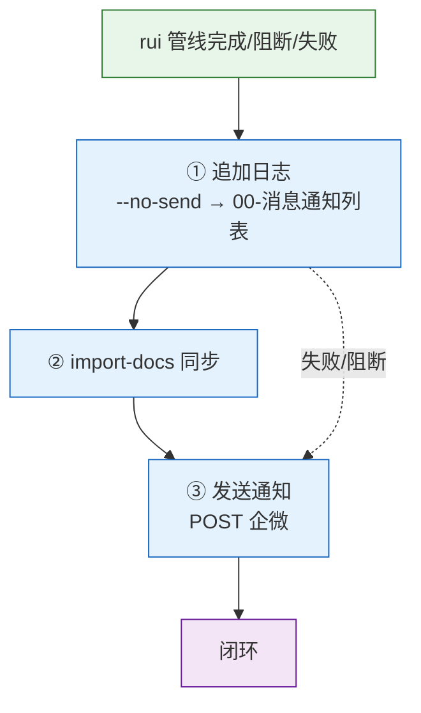
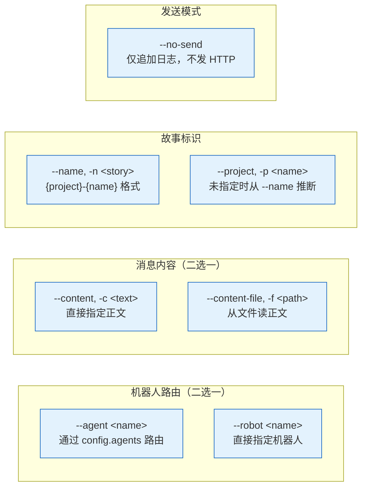
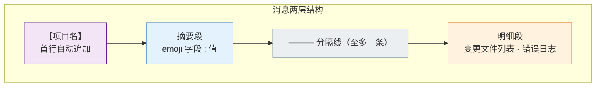
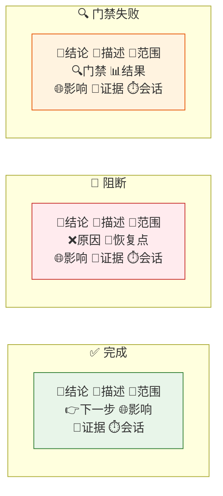
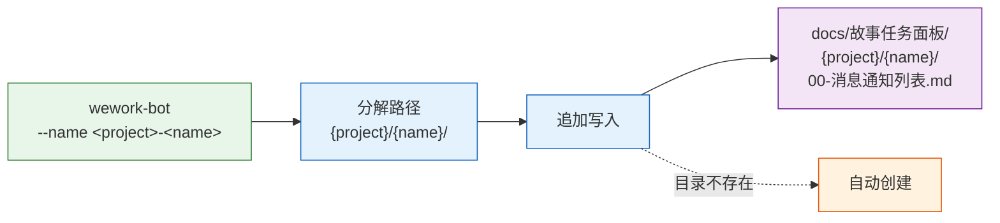
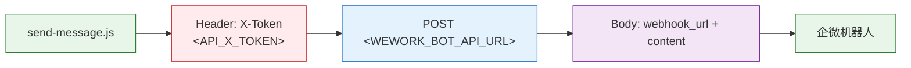
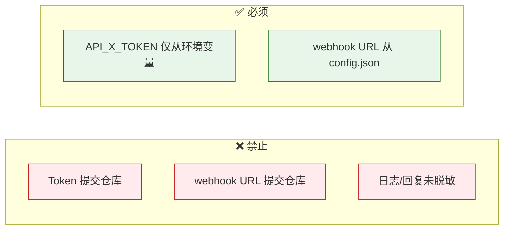
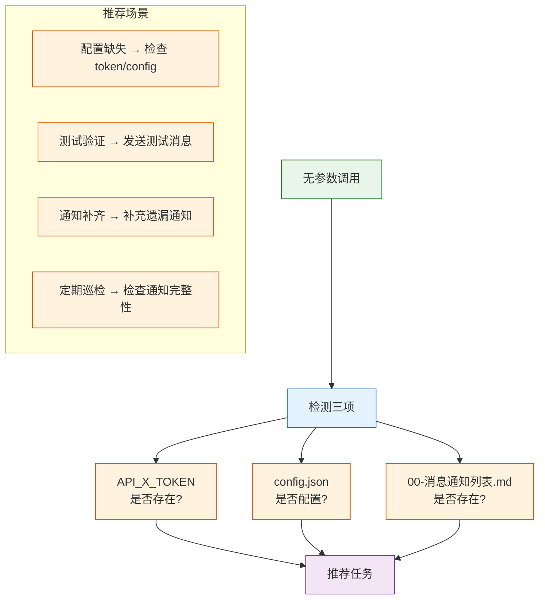
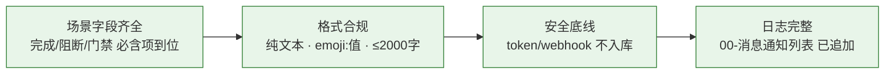

# wework-bot

企业微信机器人通知。**每次使用 rui 技能都必须触发 wework-bot，这是管线完整性的硬性要求。** rui 管线末端强制步骤：自改进 → 追加日志 → 文档同步 → 发送通知。

## 工作流全景



| 步骤 | 操作 | 说明 |
|------|------|------|
| ① 追加日志 | wework-bot --no-send | 写入 00-消息通知列表.md，不发 HTTP |
| ② 文档同步 | import-docs --workspace | 推送变更到远端 |
| ③ 发送通知 | wework-bot | POST 企微 webhook |

## 参数



| 参数 | 描述 | 默认/推断 |
|------|------|---------|
| `--agent <name>` | 通过 config.agents 路由（推荐） | — |
| `--robot <name>` | 直接指定机器人 | — |
| `--project, -p <name>` | 项目名称，消息首行【项目名】 | 从 `--name` 自动推断 |
| `--name, -n <story>` | 故事全名 `{project}-{name}`，分解为日志路径 | — |
| `--content, -c <text>` | 消息正文 | — |
| `--content-file, -f <path>` | 从文件读正文 | — |
| `--no-send` | 仅追加日志，不发送 HTTP | false |

| 环境变量 | 说明 |
|---------|------|
| `API_X_TOKEN` | 必填，仅从环境变量读取 |
| `WEWORK_BOT_API_URL` | 可选，webhook URL 由 config.json 解析 |
| `WEWORK_BOT_CONFIG` | 可选 |

## 消息格式



纯文本分行，emoji 前缀 + `:` 分隔。禁用 markdown。

### 必含字段（按场景）



| 场景 | 必含字段 | 特有字段 |
|------|---------|---------|
| 完成 | 🎯结论 📝描述 📌范围 🌐影响 📎证据 ⏱️会话 | 👉下一步 |
| 阻断 | 🎯结论 📝描述 📌范围 🌐影响 📎证据 ⏱️会话 | ❌原因 🧭恢复点 |
| 门禁失败 | 🎯结论 📝描述 📌范围 🌐影响 📎证据 ⏱️会话 | 🔍门禁 📊结果 |

### 格式约束

| # | 规则 | 反例 |
|---|------|------|
| 1 | 每行一个字段，emoji 后 `:` 分隔 | 同一行堆叠多个字段 |
| 2 | 分隔线仅用 `———`，至多一条 | 用 `---` 或 `***` 分隔 |
| 3 | 数字来自执行结果，禁止占位符 | `⏱️ 会话: {duration}` |
| 4 | 全文 ≤ 2000 字 | 超长错误日志全量粘贴 |
| 5 | 明细段：错误日志前 20 行，文件 > 10 个时只列统计 | 50 个文件逐行列出 |

### 示例

```
【YiWeb】
🎯 结论: 完成 YiWeb-user-login 文档管线
📝 描述: 为登录模块生成故事板，覆盖密码登录、短信验证码、OAuth 三种场景
📌 范围: auth/
👉 下一步: 运行 /rui code YiWeb-user-login 开始编码实现
🌐 影响: docs/故事任务面板/YiWeb/user-login/01-故事任务.md
📎 证据: git log --oneline -1
⏱️ 会话: 自适应规划→策展 全流程 3.2min | 3 agents 参与

———

变更文件: docs/故事任务面板/YiWeb/user-login/01-故事任务.md (新增, 285行)
```

## 消息通知列表



| 项目 | 说明 |
|------|------|
| 触发条件 | 指定 `--name` 时 |
| 写入模式 | 追加（append） |
| 分割线 | `【yyyy-mm-dd hh:mm:ss】` |
| 目录处理 | 不存在时自动创建 |

## API 契约



```
POST <WEWORK_BOT_API_URL>
Headers: X-Token: <API_X_TOKEN>
Body: { "webhook_url": "<from config>", "content": "<message>" }
```

| 要素 | 来源 |
|------|------|
| webhook URL | `config.json` 解析 |
| API_X_TOKEN | 环境变量 |
| content | `--content` / `--content-file` |

## 安全



| # | 规则 | P0? |
|---|------|:---:|
| 1 | 禁止提交 token、webhook URL 到仓库 | ✅ |
| 2 | 日志和回复必须脱敏 | ✅ |
| 3 | API_X_TOKEN 仅从环境变量读取 | ✅ |
| 4 | webhook URL 从 config.json 解析 | — |

## 空输入



无参数时检测 `API_X_TOKEN` / config.json / 故事面板 `00-消息通知列表.md` → 推荐任务，不发送消息。

## 生效标志



| 标志 | 未达标的处置 |
|------|------------|
| 场景字段齐全 | 补齐缺失字段，重新发送 |
| 格式合规（纯文本 · emoji:值 · ≤2000字） | 修正格式，重新发送 |
| token/webhook 不入库 | 从 git 历史清除，轮换凭据 |
| 00-消息通知列表 已追加 | 补写日志条目 |
