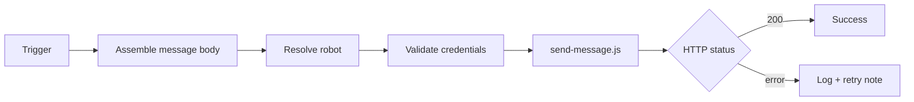

# wework-bot



## 定位

企业微信机器人通知 skill：将阶段状态、阻断原因和验证结果推送到企业微信群机器人，支持按 agent 路由到不同机器人。

## 何时使用

- 用户请求向企业微信群/机器人发送信息
- 长流程需要外部可观测性（阶段状态/阻断/门禁失败/验证结论）
- **流水线强制步骤**：`rui` 完成/阻断/门禁失败必须通知，顺序：先 `import-docs`，再 `wework-bot`
- 不触发的情况：用户仅写草稿但明确不发送；目标是同步文档（使用 `import-docs`）

## 输入

| 参数 | 描述 |
|-----------|-------------|
| `API_X_TOKEN` | 必填，仅从系统环境变量读取 |
| `WEWORK_BOT_API_URL` | 可选，覆盖默认 API |
| `WEWORK_BOT_CONFIG` | 可选，路由 JSON 路径（默认为仓库内 `config.json`） |
| `--agent` | 通过 `config.agents` 映射到机器人（推荐） |
| `--robot` | 直接指定机器人名称（极少使用） |
| `--content` / `-c` | 完整正文字符串 |
| `--content-file` / `-f` | 从 UTF-8 文件读取正文（长文案推荐） |

Webhook 仅在 `config.json` 中配置，无 CLI 参数。

## 工作流程

1. 组装消息：按电梯演讲和契约编写完整正文
2. 选择机器人：`config.json` 通过 `--agent` 或 `--robot` 解析 webhook；未指定时使用 `default_robot`
3. 验证凭据：`API_X_TOKEN` + 来自 config 的 webhook
4. 发送：`node skills/wework-bot/scripts/send-message.js --agent … --content-file …`
5. 汇总结果：根据 HTTP 状态码判断成功/失败

## 推送文案与反幻觉

- 需要系统事实核查时参照 [`agents/AGENT.md`](../../agents/AGENT.md#证据标准反幻觉) 中的证据标准
- 正文转义：字面量 `\n` 应使用 `--content-file` 或脚本 `normalizeMessageText` 规范化

## 消息格式（单一真源）

完整契约：`rules/message-contract.md`。核心约定：
- **摘要段**（分隔线之上）：约 10 行，清晰呈现结论、影响、下一步
- **明细段**（分隔线之下）：供研发验证
- 摘要必须包含：`🎯 结论` + `📝 描述` + `📌 范围` + `👉 下一步`
- 完成/阻断/门禁必须包含：`🌐 影响` + `📎 证据` + `⏱️ 会话`

## 示例

```bash
API_X_TOKEN=*** node skills/wework-bot/scripts/send-message.js \
  --agent rui \
  -f ./tmp/wework-body.md
```

## 门禁失败/失效强制通知

门禁未通过、未执行、缺证据或降级未记录 → 必须发送，摘要必须包含结论、门禁名称、原因、影响、恢复点。

## 会话中断强制通知

任何异常终止必须发送，必须说明流程/阶段、中断原因、影响范围、证据和恢复点。`⏱️ 会话` 行合并耗时与用量。

## 安全约束

- 不得提交真实 X-Token、webhook URL 或 key
- 回复中仅展示脱敏摘要
- 完成通知为强制步骤；其他场景默认不自动发送

## 支持文件

- `rules/message-contract.md`：消息格式、安全、调用契约
- `config.json`：默认配置（已提交）
- `scripts/send-message.js`：发送脚本

## 消息格式细节

**两层结构**: 摘要段（分隔线上，≤600 字）+ 明细段（分隔线下）。

**摘要必含**: `🎯 结论` + `📝 描述`(≤100 字) + `📌 范围` + `👉 下一步`。完成/阻断/门禁类追加 `🌐 影响` + `📎 证据` + `⏱️ 会话`(合并耗时+用量)。

**阻断类追加**: `❌ 原因`(≤2 条) + `🧭 恢复点`。门禁类追加 `🔍 门禁` + `📊 结果`。

**格式约束**: 分隔线至多两条；数字须来自执行结果，禁止占位符；全文 ≤2000 字；正文不得出现字面量 `\n`。

**API 契约**: `POST <WEWORK_BOT_API_URL>`，体 `{"webhook_url": "...", "content": "..."}`，Header `X-Token` = `API_X_TOKEN`（仅环境变量）。

**安全**: 不得提交 token、webhook URL 或 key。日志和回复必须脱敏。
