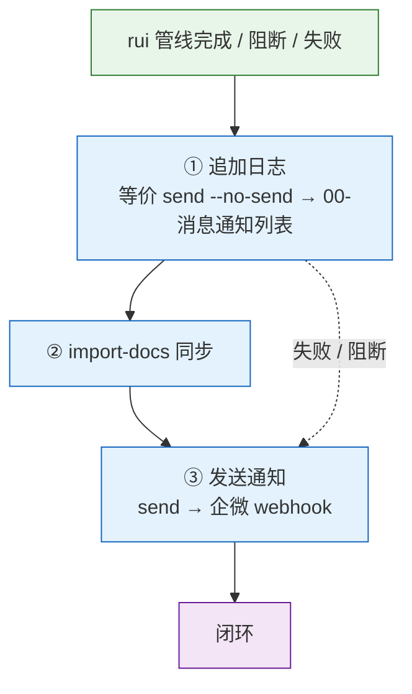
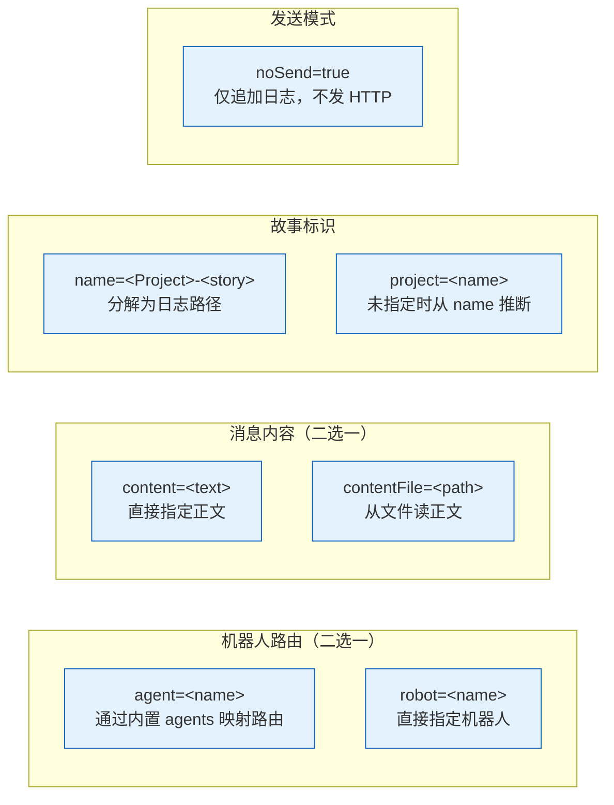
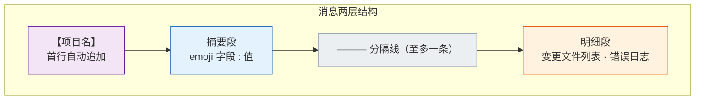
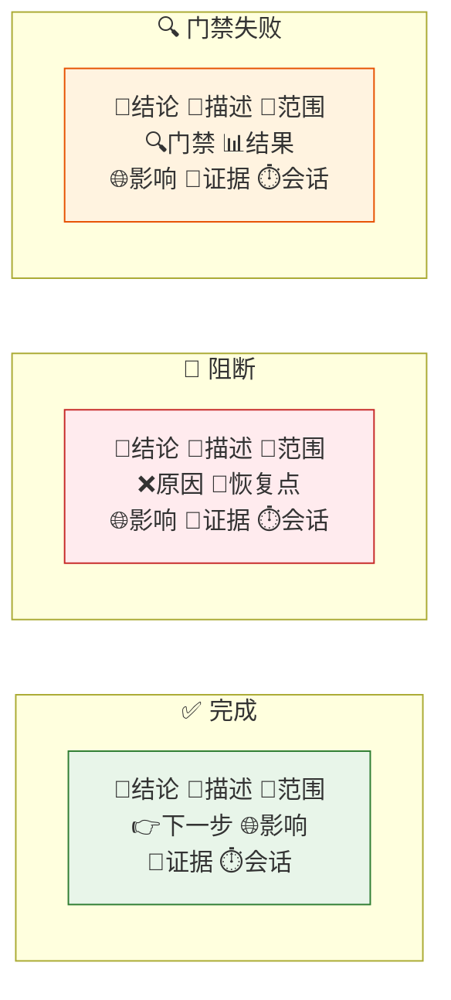
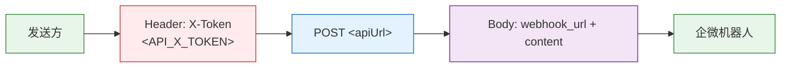
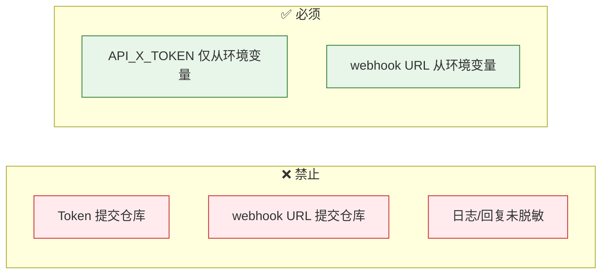
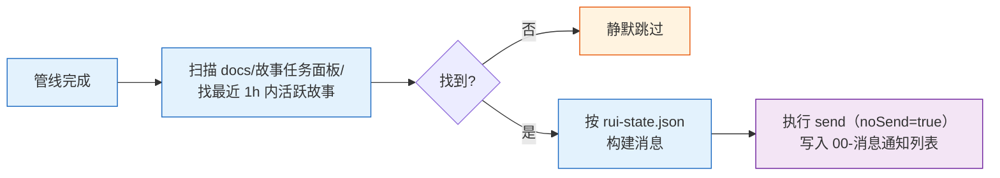
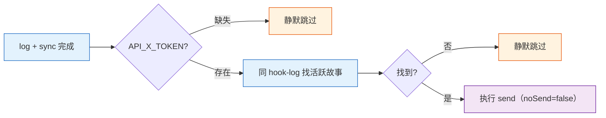
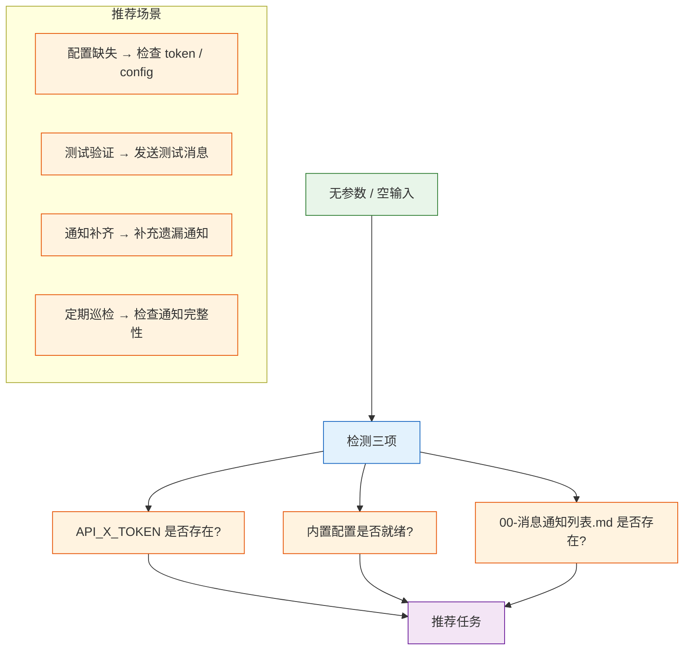
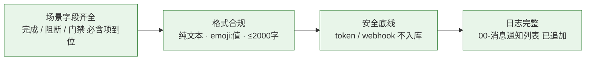

# wework-bot

企业微信机器人通知。**每次使用 rui 技能都必须触发 wework-bot，这是管线完整性的硬性要求。** rui 管线末端强制步骤：自改进 → 追加日志 → 文档同步 → 发送通知。本技能不附带可执行脚本，所有行为按本规约执行。

## 工作流全景



| 步骤 | 操作 | 说明 |
|------|------|------|
| ① 追加日志 | `send --no-send` 等价行为 | 写入 `00-消息通知列表.md`，不发 HTTP |
| ② 文档同步 | `import-docs` workspace 全量同步 | 推送变更到远端 |
| ③ 发送通知 | `send` 等价行为 | POST 企微 webhook |

## 调用形态

> 本技能没有可执行入口，调用方按下表传入参数，执行规约定义的发送/日志流程。

### 路由 / 内容 / 标识 / 模式



| 参数 | 描述 | 默认 / 推断 |
|------|------|---------|
| `agent=<name>` | 通过内置 agents 映射路由（推荐） | — |
| `robot=<name>` | 直接指定机器人 | — |
| `project=<name>` | 项目名，作为消息首行 `【项目名】` | 从 `name` 推断；无 `name` 时取 `basename(项目根)` |
| `name=<Project-story>` | 故事全名，分解为 `<Project>/<story>/` 日志路径 | — |
| `content=<text>` | 消息正文 | — |
| `contentFile=<path>` | 从文件读正文（相对路径基于项目根） | — |
| `apiUrl=<url>` | 通知网关地址 | `WEWORK_BOT_API_URL` 或默认 `https://api.effiy.cn/wework/send-message` |
| `noSend=true` | 仅追加日志，不发送 HTTP | `false` |

| 环境变量 | 说明 |
|---------|------|
| `API_X_TOKEN` | 必填，仅从环境变量读取 |
| `WEWORK_BOT_API_URL` | 可选，覆盖默认 `api_url` |
| `<robot>.webhook_url_env` 指定的变量 | 优先于 `webhook_url` 字面量 |

### 故事名解析

```
name = "<Project>-<story>"   # 以首个 - 切分
  → project = name 首段
  → story   = name 余段
  → 日志路径 = docs/故事任务面板/<Project>/<story>/00-消息通知列表.md
```

`name` 不含 `-` 时，`project` 与 `story` 同名（仍按上式生成路径）。

### 内置配置

以下配置已内嵌于技能文档，无需外部 `config.json`：

| 配置项 | 默认值 | 覆盖方式 |
|--------|--------|---------|
| `api_url` | `https://api.effiy.cn/wework/send-message` | `WEWORK_BOT_API_URL` 环境变量或 `apiUrl` 参数 |
| `default_robot` | `general` | `robot` 参数 |
| `agents.rui` | `general` | `robot` 参数 |
| `robots.general.webhook_url` | （空） | 环境变量注入 |

机器人解析优先级：`robot` 参数 > `agents[agent]` > `default_robot`（`general`）。
webhook URL 解析优先级：环境变量 > `robots[robot].webhook_url` > 默认空值。
真实 webhook URL 应通过环境变量注入，禁止写入文档或提交仓库。

## 消息格式



纯文本分行，emoji 前缀 + `:` 分隔。禁用 markdown。

### 必含字段（按场景）



| 场景 | 必含字段 | 特有字段 |
|------|---------|---------|
| 完成 | 🎯结论 📝描述 📌范围 🌐影响 📎证据 ⏱️会话 | 👉下一步 |
| 阻断 | 🎯结论 📝描述 📌范围 🌐影响 📎证据 ⏱️会话 | ❌原因 🧭恢复点 |
| 门禁失败 | 🎯结论 📝描述 📌范围 🌐影响 📎证据 ⏱️会话 | 🔍门禁 📊结果 |

### 格式约束

| # | 规则 | 反例 |
|---|------|------|
| 1 | 每行一个字段，emoji 后 `:` 分隔 | 同一行堆叠多个字段 |
| 2 | 分隔线仅用 `———`，至多一条 | 用 `---` 或 `***` 分隔 |
| 3 | 数字来自执行结果，禁止占位符 | `⏱️ 会话: {duration}` |
| 4 | 全文 ≤ 2000 字 | 超长错误日志全量粘贴 |
| 5 | 明细段：错误日志前 20 行，文件 > 10 个时只列统计 | 50 个文件逐行列出 |
| 6 | 首行 `【项目名】` 由发送方自动追加，正文不再重复 | 正文也以 `【项目名】` 开头 |

### 示例

```
【YiWeb】
🎯 结论: 完成 YiWeb-user-login 文档管线
📝 描述: 为登录模块生成故事板，覆盖密码登录、短信验证码、OAuth 三种场景
📌 范围: auth/
👉 下一步: 运行 /rui code YiWeb-user-login 开始编码实现
🌐 影响: docs/故事任务面板/YiWeb/user-login/01-故事任务.md
📎 证据: git log --oneline -1
⏱️ 会话: 自适应规划→策展 全流程 3.2min | 3 agents 参与

———

变更文件: docs/故事任务面板/YiWeb/user-login/01-故事任务.md (新增, 285行)
```

## 消息通知列表


| 项目 | 说明 |
|------|------|
| 触发条件 | 指定了 `name` 时（无 `name` 时跳过日志） |
| 写入模式 | 追加（append） |
| 时间戳 | `【YYYY-MM-DD HH:mm:ss】` 单独一行作为分隔 |
| 条目格式 | 时间戳行 + 空行 + 完整正文（含首行 `【项目名】`） + 末尾换行 |
| 目录处理 | 不存在时递归创建 |
| `noSend=true` | 仍执行日志写入 |

## API 契约



```
POST <apiUrl>
Headers:
  Content-Type: application/json
  X-Token: <API_X_TOKEN>
Body:
  { "webhook_url": "<resolved>", "content": "<message>" }

超时: 30s
成功: HTTP 200–299
失败: 非 2xx → 报告错误，调用方决定是否阻断
```

| 要素 | 来源 |
|------|------|
| `apiUrl` | 参数 > `WEWORK_BOT_API_URL` 环境变量 > `https://api.effiy.cn/wework/send-message` |
| webhook URL | 环境变量 > `robots[robot].webhook_url` > 默认空值 |
| `API_X_TOKEN` | 仅环境变量 |
| `content` | `content` 参数 > `contentFile` 文件内容（必须二选一） |

## 安全



| # | 规则 | P0? |
|---|------|:---:|
| 1 | 禁止提交 token、webhook URL 到仓库 | ✅ |
| 2 | 日志和回复必须脱敏（不回显 token、webhook URL） | ✅ |
| 3 | `API_X_TOKEN` 仅从环境变量读取 | ✅ |
| 4 | webhook URL 仅从环境变量解析 | — |
| 5 | 真实 webhook URL 禁止写入文档，由环境变量注入 | — |

## hook 触发器

> rui 管线末端依次触发以下两个等价行为，覆盖三步交付的 ① 与 ③。

### ① hook-log（追加日志，不发送）



| 步骤 | 行为 |
|------|------|
| 活跃故事识别 | 遍历 `docs/故事任务面板/<Project>/<story>/.memory/rui-state.json`，挑选 `timestamp` 在最近 1 小时内且最新的一条 |
| 无活跃故事 | 静默跳过，退出码 0 |
| 消息构建 | 见下文「自动消息模板」 |
| 发送 | 等价 `send agent=rui name=<Project>-<story> noSend=true content=...` |
| 失败 | 记录到 stderr，不阻断 |

### ③ hook-notify（实际发送）



| 触发 | 行为 |
|------|------|
| `API_X_TOKEN` 缺失 | 静默跳过，退出码 0 |
| 活跃故事缺失 | 静默跳过，退出码 0 |
| 网络失败 | 报告错误，但不阻断管线（`delivery-gate` 仍标记 `notification_sent`） |

### 自动消息模板

> hook 自动构建，正文不含 `【项目名】`，由 send 步骤自动拼接首行。

完成（`state.blocked = false`）:

```
🎯 结论: 完成 <Project>-<story> <current_stage> 阶段
📝 描述: 管线执行完毕
📌 范围: docs/故事任务面板/<Project>/<story>/
👉 下一步: 继续下一阶段
🌐 影响: docs/故事任务面板/<Project>/<story>/
📎 证据: .memory/rui-state.json
```

阻断（`state.blocked = true`）:

```
🎯 结论: 阻断 <Project>-<story>
📝 描述: 管线在 <current_stage> 阶段被阻断
📌 范围: docs/故事任务面板/<Project>/<story>/
❌ 原因: <state.block_reason 或 "见 rui-state.json">
🧭 恢复点: <current_stage>
🌐 影响: docs/故事任务面板/<Project>/<story>/
📎 证据: .memory/rui-state.json
```

## 空输入



无参数时不发送消息，仅检测 `API_X_TOKEN` / 内置配置 / 故事面板 `00-消息通知列表.md` 并输出推荐任务。

## 生效标志



| 标志 | 未达标的处置 |
|------|------------|
| 场景字段齐全 | 补齐缺失字段，重新发送 |
| 格式合规（纯文本 · emoji:值 · ≤2000字） | 修正格式，重新发送 |
| token / webhook 不入库 | 从 git 历史清除，轮换凭据 |
| `00-消息通知列表` 已追加 | 补写日志条目 |
