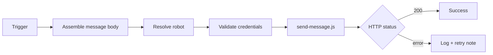

# wework-bot



## 定位

企业微信机器人通知 skill：将阶段状态、阻断原因和验证结果推送到企业微信群机器人，支持按 agent 路由到不同机器人。

## 何时使用

- 用户请求向企业微信群/机器人发送信息
- 长流程需要外部可观测性（阶段状态/阻断/门禁失败/验证结论）
- **流水线强制步骤**：`rui` 完成/阻断/门禁失败必须通知，顺序：自改进 → `import-docs` → `wework-bot`
- 不触发的情况：用户仅写草稿但明确不发送；目标是同步文档（使用 `import-docs`）

## 输入

| 参数 | 描述 |
|-----------|-------------|
| `API_X_TOKEN` | 必填，仅从系统环境变量读取 |
| `WEWORK_BOT_WEBHOOK_URL` | 必填，企业微信 Webhook 完整 URL（含 key），仅从系统环境变量读取 |
| `WEWORK_BOT_API_URL` | 可选，覆盖默认 API |
| `WEWORK_BOT_CONFIG` | 可选，路由 JSON 路径（默认为仓库内 `config.json`） |
| `--agent` | 通过 `config.agents` 映射到机器人（推荐） |
| `--robot` | 直接指定机器人名称（极少使用） |
| `--content` / `-c` | 完整正文字符串 |
| `--content-file` / `-f` | 从 UTF-8 文件读取正文（长文案推荐） |

Webhook 仅在 `config.json` 中配置，无 CLI 参数。

## 工作流程

1. 组装消息：按电梯演讲和契约编写完整正文
2. 选择机器人：`config.json` 通过 `--agent` 或 `--robot` 解析 webhook；未指定时使用 `default_robot`
3. 验证凭据：`API_X_TOKEN` + 来自 config 的 webhook
4. 发送：`node .claude/skills/wework-bot/scripts/send-message.js --agent … --content-file …`
5. 汇总结果：根据 HTTP 状态码判断成功/失败

## 推送文案与反幻觉

- 需要系统事实核查时参照 [`.claude/agents/AGENT.md`](../../agents/AGENT.md#证据标准反幻觉) 中的证据标准
- 正文转义：字面量 `\n` 应使用 `--content-file` 或脚本 `normalizeMessageText` 规范化

## 消息格式

纯文本分行，emoji 前缀标识字段。禁止 markdown 语法（`#` `**` `-` `>` 等）。两层结构：摘要段 + 明细段，中间 `———` 分隔。

### 格式示例

```
🎯 结论: 完成 user-login 文档管线
📝 描述: 为登录模块生成故事板，覆盖密码登录、短信验证码、OAuth 三种场景
📌 范围: auth/
👉 下一步: 运行 /rui code user-login 开始编码实现
🌐 影响: docs/storyboards/user-login.md
📎 证据: git log --oneline -1
⏱️ 会话: 自适应规划→策展 全流程 3.2min | 3 agents 参与
```

### 摘要段必含字段

🎯 结论 — 始终 | 一句话结论
📝 描述 — 始终 | ≤100 字概述
📌 范围 — 始终 | 涉及的子项目/模块
👉 下一步 — 始终 | 后续操作或恢复点
🌐 影响 — 完成/阻断/门禁 | 受影响的文件/模块/用户
📎 证据 — 完成/阻断/门禁 | 验证命令或路径
⏱️ 会话 — 完成/阻断/门禁 | 合并耗时+用量
❌ 原因 — 阻断 | ≤2 条阻断原因
🧭 恢复点 — 阻断 | 从何处恢复
🔍 门禁 — 门禁失败 | 门禁名称
📊 结果 — 门禁失败 | 实际结果

### 明细段

摘要段后空一行，`———` 分隔线后再空一行，放详细上下文：变更文件列表、代码片段、完整错误日志等。

### 格式约束

- 纯文本分行，禁用 markdown 语法
- 分隔线仅用 `———`（至多一条）
- 每行一个字段，emoji 前缀后用 `:` 分隔
- 数字须来自执行结果，禁止占位符（如 N、X）
- 全文 ≤2000 字
- 正文不得出现字面量 `\n`（使用 `--content-file` 或脚本规范化）

### 强制通知场景

| Scenario | Required Fields |
|----------|----------------|
| rui 完成 | 🎯 结论 + 📝 描述 + 📌 范围 + 👉 下一步 + 🌐 影响 + 📎 证据 + ⏱️ 会话 |
| 阻断 | 🎯 结论 + 📝 描述 + 📌 范围 + ❌ 原因 + 🧭 恢复点 + 🌐 影响 + 📎 证据 + ⏱️ 会话 |
| 门禁失败 | 🎯 结论 + 📝 描述 + 📌 范围 + 🔍 门禁 + 📊 结果 + 🌐 影响 + 📎 证据 + ⏱️ 会话 |
| 会话中断 | 流程/阶段 + 中断原因 + 影响范围 + 📎 证据 + 🧭 恢复点 + ⏱️ 会话 |

## API 契约

```
POST <WEWORK_BOT_API_URL>
Headers: X-Token: <API_X_TOKEN>
Body: { "webhook_url": "<from config>", "content": "<message>" }
```

## 安全约束

- 不得提交 token、webhook URL 或 key 到仓库
- 日志和回复必须脱敏
- 完成通知为强制步骤；其他场景默认不自动发送

## 示例

```bash
API_X_TOKEN=*** node skills/wework-bot/scripts/send-message.js \
  --agent rui \
  -f ./tmp/wework-body.md
```

## 支持文件

- `scripts/send-message.js`：发送脚本
- `config.json`：Webhook 路由配置
