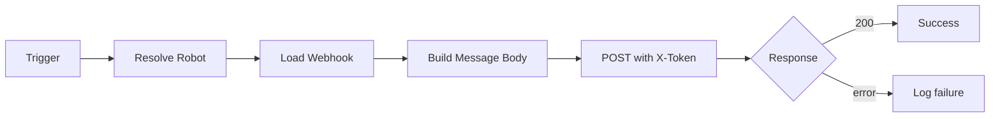

# wework-bot 消息契约



## API 契约

请求：`POST <WEWORK_BOT_API_URL>`，体为 `{"webhook_url": "<url>", "content": "<正文>"}`

认证：Header `X-Token`，仅来自系统环境变量 `API_X_TOKEN`（不接受命令行参数）。

客户端须携带与目标站点一致的 Origin/Referer；脚本使用浏览器风格请求头（User-Agent、Sec-Fetch-*、sec-ch-ua），避免网关拒绝。

## webhook 配置

优先级：`--robot` > `--agent` 映射 > `default_robot`；从 `config.json` 中选中 robot 的 `webhook_url` 或 `webhook_key`。

多机器人配置示例：

```json
{
  "default_robot": "general",
  "api_url": "<WEWORK_BOT_API_URL>",
  "robots": {
    "general": { "webhook_url": "https://qyapi.weixin.qq.com/cgi-bin/webhook/send?key=<key>" },
    "security": { "webhook_url": "https://qyapi.weixin.qq.com/cgi-bin/webhook/send?key=<另一key>" }
  },
  "agents": {
    "build-feature": "general",
    "tester": "general"
  }
}
```

机器人字段：`webhook_url`（推荐，完整 URL）、`webhook_key`（可选，仅 key，脚本拼接）、`api_url`（可选覆盖）。

`X-Token` 不得写入配置文件。

## 消息格式

### 管理层阅读优先（摘要/明细分层）

**摘要段（分隔线之上）**：约 10 行内，让读者先读完结论、影响、下一步。禁止在摘要里粘贴完整调用链。

**明细段（分隔线之下）**：`────────────【以下为核对明细】────────────` 之后放技术细节。

**合并同类项**：
- `📌 范围：` 一行替代项目名+功能描述
- `⏱️ 会话：` 一行合并耗时+用量；无可靠数据时写「未记录，请核对账单」
- `📎 证据：` 摘要里一行为主；路径罗列放入明细段
- `💡 改进建议`：≤120 字、≤2 条，仅在有 actionable 项时追加

`📝 描述：` ≤100 字。

### 摘要段必含

**所有类型**：标题行 + `🎯 结论` + `📝 描述` + `📌 范围` + `👉 下一步`

**完成/阻断/门禁异常须补充**：`🌐 影响` + `📎 证据` + `⏱️ 会话`；阻断类还须 `❌ 原因`（≤2 条）+ `🧭 恢复点`；门禁类还须 `🔍 门禁` + `📊 结果`

### 明细段（有来源时写入，无来源则省略）

- `🔗 调用链`、`🤝 AI 调用`
- `🤖 模型`、`🧰 工具`、`🕒 最后更新`（精确到秒）
- `🌿 分支`、`🔖 提交`
- `📐 实施总结图表`、`🧾 待办与风险`、`🗂️ 状态回写`、`📁 测试路径`、`📦 产物`、`☁️ 文档同步`、`📂 报告`

### 格式要求

- 分隔线至多两条：标题下 `━━━` + 摘要与明细之间「核对明细」
- 数字须来自执行结果，禁止 `<占位符>` 直接发送
- 摘要段 ≤600 字；含明细全文 ≤2000 字
- 阻断类不得因压缩删掉摘要中的原因、影响、恢复点
- `☁️ 文档同步`：仅在已执行 `import-docs` 时填写；`docs` 不存在写跳过说明；缺 `API_X_TOKEN` 可省略该行并说明
- 正文不得出现字面量 `\n`，用 `--content-file` 或脚本 `normalizeMessageText`

## 观测点

**build-feature (document mode)**：开始生成 / P0 自检失败 / 缺参写入 `99_agent-runs` / `import-docs` 同步完成

**build-feature (code mode)**：阶段 0/2/4/6/7 完成 / 任意阻断需人工介入 / 门禁未执行/无证据/被跳过

**import-docs**：导入完成产生汇总 / 导入失败但主流程继续

## 安全约束

- 不得提交真实 `X-Token`、完整 webhook URL 或 key
- 日志和最终回复必须脱敏
- 缺少 token 或 webhook 时必须停止，不尝试匿名发送
- 通知发送失败时须在实施总结或 `docs/99_agent-runs/` 兜底记录