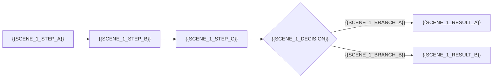

# 使用场景

> | v0.1.0 | {{DATE}} | {{AUTHOR}} | 📎 [CLAUDE.md](../../../CLAUDE.md) |

> **导航**: [← 故事任务](./故事任务.md) · [技术评审 →](./技术评审.md)
>
> **来源引用**：基于 [故事任务](./故事任务.md) §1 Story 1–N。

---

[§1 使用场景](#s-1-使用场景){{SCENE_TOC}}

## 概述

{{SCENES_OVERVIEW}}

### 主要价值

- 🎯 覆盖 N 种用户角色 — {{ROLES_LIST}}
- 🔒 异常路径可见 — 每场景含 API 失败、空状态、错误恢复
- ⚡ 交互链路清晰 — 每场景含 mermaid 流程图

---

## §1 使用场景

### 场景 1: {{SCENE_1_TITLE}}

**角色**: {{SCENE_1_ROLE}}
**目标**: {{SCENE_1_GOAL}}
🏗️ 技术评审: [场景 1 全维度技术方案](./技术评审.md#s-{{SCENE_1_ANCHOR}})

| 步骤 | 操作 | 预期结果 |
|------|------|---------|
| 1 | {{SCENE_1_OP_1}} | {{SCENE_1_EXPECTED_1}} |
| 2 | {{SCENE_1_OP_2}} | {{SCENE_1_EXPECTED_2}} |
| 3 | {{SCENE_1_OP_3}} | {{SCENE_1_EXPECTED_3}} |

---

<!-- 按需复制上述场景模板添加场景 2、场景 3... -->

---

> **变更记录**
> | 日期 | 变更 | 触发 | 证据 |
> |------|------|------|------|
> | {{DATE}} | 初始化 | 模板创建 | — |
