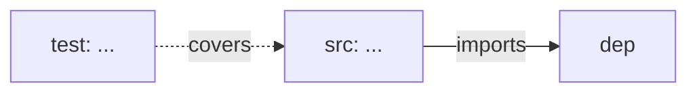

# 场景 {{N}}: {{NAME}}

> | v{{VERSION}} | {{DATE}} | {{AUTHOR}} | 🌿 feat/{{STORY_NAME}} | 📎 [CLAUDE.md](../../../CLAUDE.md) |
> **导航**: [← 故事任务](./故事任务.md) · [后继 →](./场景-{{N+1}}-xxx.md)

[§0 技术评审](#sec0) · [§1 测试设计](#sec1) · [§2 实施报告](#sec2) · [§3 测试报告](#sec3) · [§4 自改进](#sec4)

## 概述

**角色**: {{ROLE}} · **目标**: {{GOAL}} · **优先级**: {{PRIORITY}}

### 图谱定位

| 图层 | 本场景节点 | 上游 | 下游 |
|------|-----------|------|------|
| 领域层 | scene: {{N}} | story: {{STORY_NAME}} (contains) | maps_to → 结构层 |
| 结构层 | src: ... / test: ... | maps_to 来自领域层 | verifies · Read → 内容层 |
| 内容层 | Read/Grep 获取 | Read 来自结构层 | — |

---

<a id="sec0"></a>
## §0 技术评审

> 文档生成阶段填充（pm+coder）。

### 效果示意


### 涉及模块

| 模块 | 路径 | 职责 | 本场景角色 |
|------|------|------|-----------|

### API 端点

| 方法 | 路径 | 用途 | curl |
|------|------|------|------|

### 设计评审清单

| # | 检查项 | 状态 |
|---|--------|:--:|

---

<a id="sec1"></a>
## §1 测试设计

> 文档生成阶段填充（tester）。

### 正常路径用例

| TC# | Given | When | Then | 覆盖 FP# | 优先级 |
|-----|-------|------|------|---------|--------|

### 边界/异常用例

| TC# | Given | When | Then | 覆盖 FP# | 优先级 |
|-----|-------|------|------|---------|--------|

### Gate A 交接

| 项目 | 状态 |
|------|:--:|
| 每 FP ≥3 类用例 | |
| Gate A 判定 | |

---

<a id="sec2"></a>
## §2 实施报告

> 实现阶段填充（coder）。**本节是知识图谱结构层的核心**。

### 操作步骤记录

> 按时间顺序记录每一步实际操作，不可合并、跳步或事后补写。

| 步# | 时间 | 操作 | 文件/命令 | 结果 | 备注 |
|-----|------|------|----------|------|------|
| 1 | HH:MM | 分支隔离检查 | `node skills/rui/branch-check.mjs --story=<name> --mode=write` | ✓/✗ | |
| 2 | HH:MM | 读设计文档 | `Read <path>` | ✓ | 场景-1-xxx.md §0 §1 |
| 3 | HH:MM | 模块 1 编码 | `Edit/Write <file>` | ✓/✗ | 描述改动 |
| 4 | HH:MM | 模块 1 P0 审查 | 对照审查维度逐项检查 | ✓/✗ | 见下方 P0 审查表 |
| 5 | HH:MM | 模块 2 编码 | `Edit/Write <file>` | ✓/✗ | 描述改动 |
| ... | ... | ... | ... | ... | ... |

### 开发源码清单

| 节点 ID | 文件路径 | 类型 | 行数 | 关键导出 | 逻辑摘要 |
|---------|---------|------|------|---------|---------|

### 测试源码清单

| 节点 ID | 文件路径 | 类型 | 行数 | 框架 | 覆盖节点 | 用例数 |
|---------|---------|------|------|------|---------|--------|

### 依赖图



### P0 审查表

| 模块 | P0 项 | 状态 | 修复 |
|------|-------|:--:|------|

### 效果验证

```bash
# 可执行的验证命令
```

---

<a id="sec3"></a>
## §3 测试报告

> 验证阶段填充（tester）。

### 操作步骤记录

> 按时间顺序记录每一步测试操作，不可合并、跳步或事后补写。

| 步# | 时间 | 操作 | 命令/文件 | 结果 | 备注 |
|-----|------|------|----------|------|------|
| 1 | HH:MM | 读实施报告 | `Read <实施报告路径>` | ✓ | 交叉引用基准 |
| 2 | HH:MM | 运行测试套件 | `npm test -- <test-file>` 或等价命令 | ✓/✗ | |
| 3 | HH:MM | 检查 TC-N 失败 | `Read <源文件>` 定位根因 | 根因: ... | |
| 4 | HH:MM | 修复后重跑 | `npm test -- <test-file>` | ✓/✗ | 修复轮次 N |
| 5 | HH:MM | 全量回归 | `npm test` | ✓/✗ | |
| ... | ... | ... | ... | ... | ... |

### 执行摘要

| 总用例 | 通过 | 失败 | 通过率 |
|--------|------|------|--------|

### 用例详情

| TC# | 结果 | 耗时 | 覆盖源文件:行号 |
|-----|------|------|---------------|

### 失败分析与修复

| 失败 TC# | 根因 | 修复 | 修复后 |
|----------|------|------|--------|

---

<a id="sec4"></a>
## §4 自改进

> 自改进阶段填充（self-improve）。

### D0–D7 诊断

| 诊断 | 触发? | 证据 | 提案 |
|------|-------|------|------|

### 改进清单

| # | 改进项 | 优先级 | 状态 |
|---|--------|--------|:--:|

### 评审清单

| # | 检查项 | 状态 |
|---|--------|:--:|
