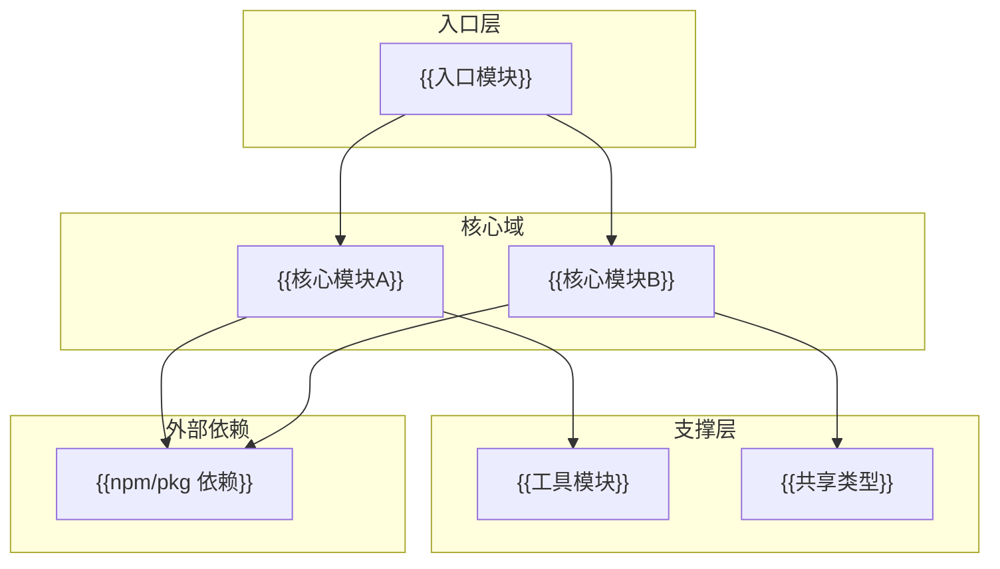
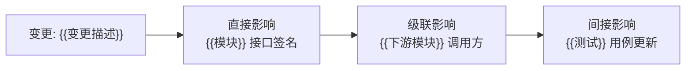
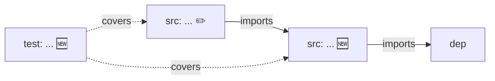

# 场景 {{N}}: {{NAME}}

> | v{{VERSION}} | {{DATE}} | {{AUTHOR}} | 🌿 feat/{{STORY_NAME}} | 📎 [CLAUDE.md](../../../CLAUDE.md) |
> **导航**: [← 场景-{{N-1}}](./场景-{{N-1}}-xxx.md) · [后继 →](./场景-{{N+1}}-xxx.md)

[§0 技术评审](#sec0) · [§1 测试设计](#sec1) · [§2 实施报告](#sec2) · [§3 测试报告](#sec3) · [§4 自改进](#sec4)

## 概述

**角色**: {{ROLE}} · **目标**: {{GOAL}} · **优先级**: {{PRIORITY}}

> 本场景聚焦 **依赖关系与变更影响**：模块间依赖图、接口契约、变更波及分析、版本兼容性。

### 图谱定位

| 图层 | 本场景节点 | 上游 | 下游 |
|------|-----------|------|------|
| 领域层 | scene: {{N}} | story: {{STORY_NAME}} (contains) | maps_to → 结构层 |
| 结构层 | src: ... / test: ... | maps_to 来自领域层 | verifies · Read → 内容层 |
| 内容层 | Read/Grep 获取 | Read 来自结构层 | — |

---

## §0 技术评审

> 依赖关系分析场景。聚焦模块间依赖图、接口契约稳定性、变更影响范围、版本兼容矩阵。

### 依赖拓扑

### 依赖矩阵

| 模块 | 依赖方向 | 被依赖 | 耦合度 | 变更风险 |
|------|---------|--------|:---:|:---:|
| {{模块A}} | C1, U1 | E1, C2 | 高 | 接口变更影响 3 个下游 |
| {{模块B}} | U2, X1 | E1 | 低 | 内部实现，下游仅依赖接口 |

### 变更影响分析

| 变更类型 | 影响级别 | 波及模块 | 兼容性 |
|---------|:---:|---------|:---:|
| 新增可选参数 | T1 | 0（向后兼容） | ✅ |
| 修改必填参数 | T3 | {{N}} 个调用方 | ❌ 需主版本升级 |
| 删除已废弃接口 | T3 | {{N}} 个残留引用 | ❌ 需迁移计划 |

### 涉及模块

| 模块 | 路径 | 职责 | 本场景角色 |
|------|------|------|-----------|
| {{模块1}} | `{{path}}` | {{职责}} | {{依赖图中的角色}} |

### 设计评审清单

| # | 检查项 | 状态 |
|---|--------|:--:|
| 1 | 依赖图覆盖全部模块及其方向 | |
| 2 | 循环依赖已识别并标记 | |
| 3 | 每对外接口有版本兼容说明 | |
| 4 | 变更影响路径完整（直接→级联→间接） | |

---

## §1 测试设计

> 依赖完整性 + 接口契约 + 变更回归测试。

### 正常路径用例

| TC# | Given | When | Then | 覆盖 FP# | 优先级 |
|-----|-------|------|------|---------|--------|

### 边界/异常用例

| TC# | Given | When | Then | 覆盖 FP# | 优先级 |
|-----|-------|------|------|---------|--------|
| TC-DEP1 | {{依赖模块}}不存在或版本不匹配 | 加载模块 | 明确错误信息，非静默失败 | | P0 |

### Gate A 交接

| 项目 | 状态 |
|------|:--:|
| 每对外接口 ≥3 类契约用例 | |
| 循环依赖检测用例 | |
| Gate A 判定 | |

---

## §2 实施报告

> 实现阶段填充（coder）。

### 操作步骤记录

| 步# | 时间 | 操作 | 文件/命令 | 结果 | 备注 |
|-----|------|------|----------|------|------|
| 1 | HH:MM | 分支隔离检查 | `node skills/rui/branch-check.mjs --story=<name> --mode=write` | ✓/✗ | |

### 开发源码清单

| 节点 ID | 文件路径 | 类型 | 行数 | 关键导出 | 逻辑摘要 |
|---------|---------|------|------|---------|---------|

### 测试源码清单

| 节点 ID | 文件路径 | 类型 | 行数 | 框架 | 覆盖节点 | 用例数 |
|---------|---------|------|------|------|---------|--------|

### 依赖图

### P0 审查表

| 模块 | P0 项 | 状态 | 修复 |
|------|-------|:--:|------|

### 效果验证

---

## §3 测试报告

> 验证阶段填充（tester）。

### 操作步骤记录

| 步# | 时间 | 操作 | 命令/文件 | 结果 | 备注 |
|-----|------|------|----------|------|------|

### 执行摘要

| 总用例 | 通过 | 失败 | 通过率 |
|--------|------|------|--------|

### 用例详情

| TC# | 结果 | 耗时 | 覆盖源文件:行号 |
|-----|------|------|---------------|

### 失败分析与修复

| 失败 TC# | 根因 | 修复 | 修复后 |
|----------|------|------|--------|

---

## §4 自改进

> 自改进阶段填充（self-improve）。

### D0–D7 诊断

| 诊断 | 触发? | 证据 | 提案 |
|------|-------|------|------|

### 改进清单

| # | 改进项 | 优先级 | 状态 |
|---|--------|--------|:--:|

### 评审清单

| # | 检查项 | 状态 |
|---|--------|:--:|
