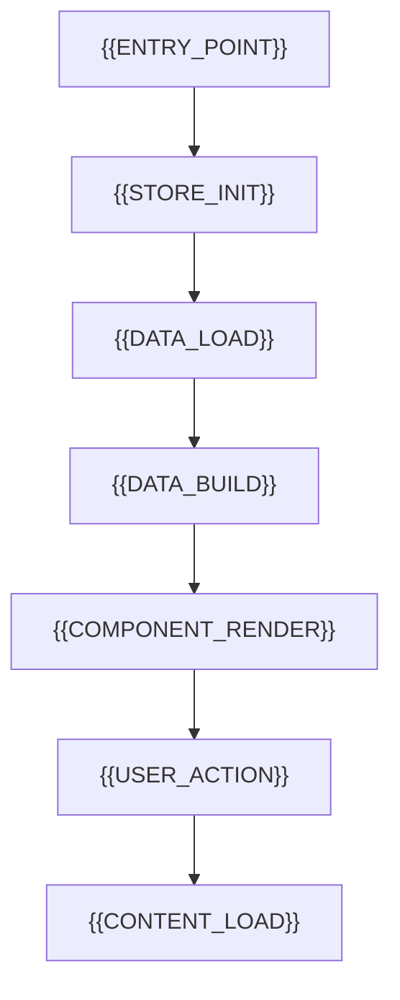
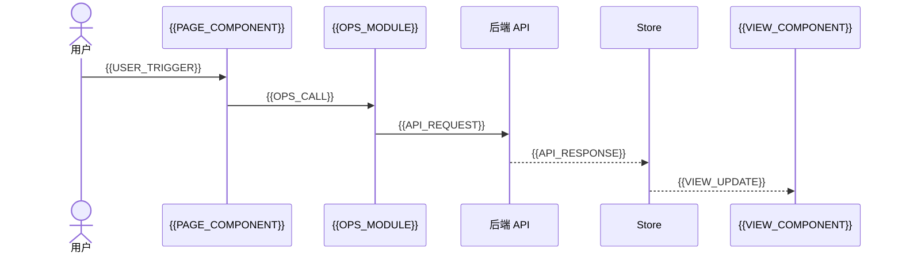
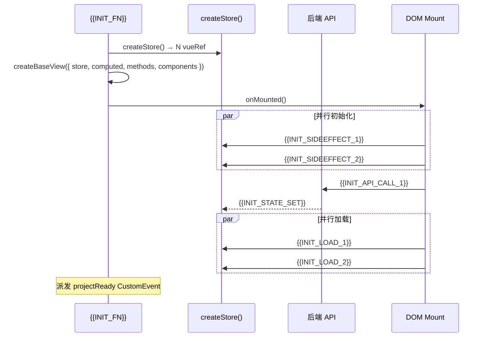

# 技术评审

> | v0.1.0 | {{DATE}} | {{AUTHOR}} | 🌿 feat/{{MODULE_NAME}} | 📎 [CLAUDE.md](../../../CLAUDE.md) |

> **导航**: [← 使用场景](./使用场景.md) · [测试设计 →](./测试设计.md)

> **来源引用**：基于 [故事任务](./故事任务.md) §1 Story 1–N 与 [使用场景](./使用场景.md) §1 场景 1–N，从 `src/views/{{MODULE_NAME}}/` 源码分析生成。

---

[§0 技术栈](#s-0-技术栈与-api-总览){{TECH_SECTIONS_TOC}} · [§6 共享架构](#s-6-跨场景共享架构)

## 概述

{{TECH_OVERVIEW}}

### 主要价值

- 🎯 N 场景全维度技术方案 — 与使用场景一一对应，每场景独立可评审
- 🔒 源码证据链 — 每模块附源码路径，可追溯可验证
- ⚡ 架构可视化 — 每场景含 mermaid 数据流图 + 布局线框 + 序列图
- 🧪 测试用例内嵌 — 每场景含 Given/When/Then 可执行用例

---

## §0 技术栈与 API 总览

### 0.1 技术栈

| 维度 | 选择 | 原因 |
|------|------|------|
| 视图框架 | {{FRAMEWORK}} | {{FRAMEWORK_REASON}} |
| 状态管理 | {{STATE_MGMT}} | {{STATE_MGMT_REASON}} |
| API 层 | {{API_LAYER}} | {{API_LAYER_REASON}} |
| 渲染增强 | {{RENDERER}} | {{RENDERER_REASON}} |

### 0.2 设计令牌

| 令牌 | 取值 | 用途 |
|------|------|------|
| `--sidebar-default-width` | {{SIDEBAR_WIDTH}} | 侧边栏初始宽度 |
| `--color-primary` | {{COLOR_PRIMARY}} | 主色调（激活态/选中态） |
| `--color-bg` | {{COLOR_BG}} | 页面背景 |
| `--color-surface` | {{COLOR_SURFACE}} | 卡片/面板表面色 |
| `--color-border` | {{COLOR_BORDER}} | 边框/分隔线 |
| `--transition-default` | {{TRANSITION}} | 默认过渡动画 |

### 0.3 API 接口总览

> {{API_BASE_NOTE}}
>
> **约束**：接口清单的「场景」列必须使用可点击的锚点链接（格式：`[§N](#s-N-场景-N-{slug})`），curl 示例按接口逐一编写。

#### 服务路由

| 路由方式 | 端点 | 用途 |
|---------|------|------|
| `{{ROUTE_1_METHOD}}` | `{{ROUTE_1_MODULE}}` | {{ROUTE_1_PURPOSE}} |
| `{{ROUTE_2_METHOD}}` | `{{ROUTE_2_MODULE}}` | {{ROUTE_2_PURPOSE}} |

#### 接口清单

| 接口 | 方法 | 服务模块 | 用途 | 场景 |
|------|------|---------|------|------|
| `{{API_1_NAME}}` | {{API_1_METHOD}} | `{{API_1_MODULE}}` | {{API_1_PURPOSE}} | {{API_1_SCENE_LINKS}} |
| `{{API_2_NAME}}` | {{API_2_METHOD}} | `{{API_2_MODULE}}` | {{API_2_PURPOSE}} | {{API_2_SCENE_LINKS}} |

<details>
<summary>curl 示例（展开查看）</summary>

#### {{API_1_NAME}}

```bash
{{API_1_CURL}}
```

#### {{API_2_NAME}}

```bash
{{API_2_CURL}}
```

</details>

---

## §1 场景 1: {{SCENE_1_TITLE}}

> 对应 [使用场景 — 场景 1](./使用场景.md#场景-{{SCENE_1_SLUG}})

### 1.1 布局线框

**视图区域**：{{LAYOUT_ZONES_DESC}}

```
{{LAYOUT_ASCII_1}}
```

| 区域 | 组件 | 关键交互 |
|------|------|---------|
| {{ZONE_1_NAME}} | {{ZONE_1_COMPONENT}} | {{ZONE_1_INTERACTION}} |
| {{ZONE_2_NAME}} | {{ZONE_2_COMPONENT}} | {{ZONE_2_INTERACTION}} |
| {{ZONE_3_NAME}} | {{ZONE_3_COMPONENT}} | {{ZONE_3_INTERACTION}} |
| {{ZONE_4_NAME}} | {{ZONE_4_COMPONENT}} | {{ZONE_4_INTERACTION}} |

### 1.2 数据流全景



### 1.3 数据流序列



### 1.4 涉及模块

| 模块 | 路径 | 职责 |
|------|------|------|
| 入口初始化 | `src/views/{{MODULE_NAME}}/index.js` | 创建 store、注册组件、启动应用 |
| Store 状态 | `src/views/{{MODULE_NAME}}/hooks/state/` | 响应式变量定义 |
| {{MODULE_2_PATH}} | `src/views/{{MODULE_NAME}}/{{MODULE_2_FILE}}` | {{MODULE_2_ROLE}} |
| {{COMPONENT_NAME}} | `src/views/{{MODULE_NAME}}/components/{{COMPONENT_DIR}}/` | {{COMPONENT_ROLE}} |

### 1.5 涉及状态

| 状态变量 | 类型 | 来源 | 消费者 |
|---------|------|------|--------|
| `{{STATE_1}}` | {{STATE_1_TYPE}} | `{{STATE_1_SOURCE}}` | {{STATE_1_CONSUMER}} |
| `{{STATE_2}}` | {{STATE_2_TYPE}} | `{{STATE_2_SOURCE}}` | {{STATE_2_CONSUMER}} |

### 1.6 API 端点

| 接口 | 方法 | 用途 | 触发时机 |
|------|------|------|---------|
| `{{ENDPOINT_1}}` | {{ENDPOINT_1_METHOD}} | {{ENDPOINT_1_PURPOSE}} | {{ENDPOINT_1_TRIGGER}} |

### 1.7 关键 UI 元素与微交互

| 元素 | DOM 位置 | 行为 |
|------|---------|------|
| {{UI_ELEMENT_1}} | `{{UI_SELECTOR_1}}` | {{UI_BEHAVIOR_1}} |
| {{UI_ELEMENT_2}} | `{{UI_SELECTOR_2}}` | {{UI_BEHAVIOR_2}} |

| 微交互 | 触发 | 反馈 | 时长 |
|------|------|------|:--:|
| {{MICRO_1_TRIGGER}} | {{MICRO_1_ACTION}} | {{MICRO_1_FEEDBACK}} | {{MICRO_1_DURATION}} |

### 1.8 测试用例

> 覆盖 AC: {{COVERED_AC_LIST}}

**正常路径:**

| Given | When | Then |
|-------|------|------|
| {{TC1_GIVEN}} | {{TC1_WHEN}} | {{TC1_THEN}} |
| {{TC2_GIVEN}} | {{TC2_WHEN}} | {{TC2_THEN}} |

**边界/异常:**

| Given | When | Then |
|-------|------|------|
| {{TC_E1_GIVEN}} | {{TC_E1_WHEN}} | {{TC_E1_THEN}} |

> 证据: `{{EVIDENCE_PATHS}}`

---

<!-- 按需复制上述 §1 模板添加 §2 场景 2、§3 场景 3... -->

---

## §6 跨场景共享架构

### 6.1 Store 工厂模式

```
store.js → state/store.js
  ├── {{STORE_VARS_COUNT}} 响应式状态变量（vueRef）
  ├── {{STORE_OPS_1}} — {{STORE_OPS_1_ROLE}}
  ├── {{STORE_OPS_2}} — {{STORE_OPS_2_ROLE}}
  └── {{STORE_OPS_3}} — {{STORE_OPS_3_ROLE}}
```

### 6.2 方法模块化

```
useMethods.js 组合出口 → methods/
  ├── {{METHODS_1}}.js → 场景 1（{{METHODS_1_ROLE}}）
  ├── {{METHODS_2}}.js → 场景 2（{{METHODS_2_ROLE}}）
  ├── {{METHODS_3}}.js → 场景 3（{{METHODS_3_ROLE}}）
  └── uiMethods.js → 跨场景（面板布局、视图切换）
```

### 6.3 响应式筛选管道

```
store.{{DATA_TREE}} (完整数据)
  → useComputed (computed 缓存)
    → 筛选 ({{FILTER_LOGIC}})
    → 搜索 ({{SEARCH_LOGIC}})
    → AND 组合
  → {{RENDER_COMPONENT}} 组件渲染
```

### 6.4 localStorage 持久化

| 键 | 类型 | 用途 | 关联场景 |
|---|------|------|---------|
| `{{LS_KEY_1}}` | {{LS_TYPE_1}} | {{LS_PURPOSE_1}} | {{LS_SCENE_1}} |
| `{{LS_KEY_2}}` | {{LS_TYPE_2}} | {{LS_PURPOSE_2}} | {{LS_SCENE_2}} |

### 6.5 初始化加载序列



---

> 证据: `{{ARCH_EVIDENCE}}`

---

> **变更记录**
> | 日期 | 变更 | 触发 | 证据 |
> |------|------|------|------|
> | {{DATE}} | 初始化 | 模板创建 | — |
