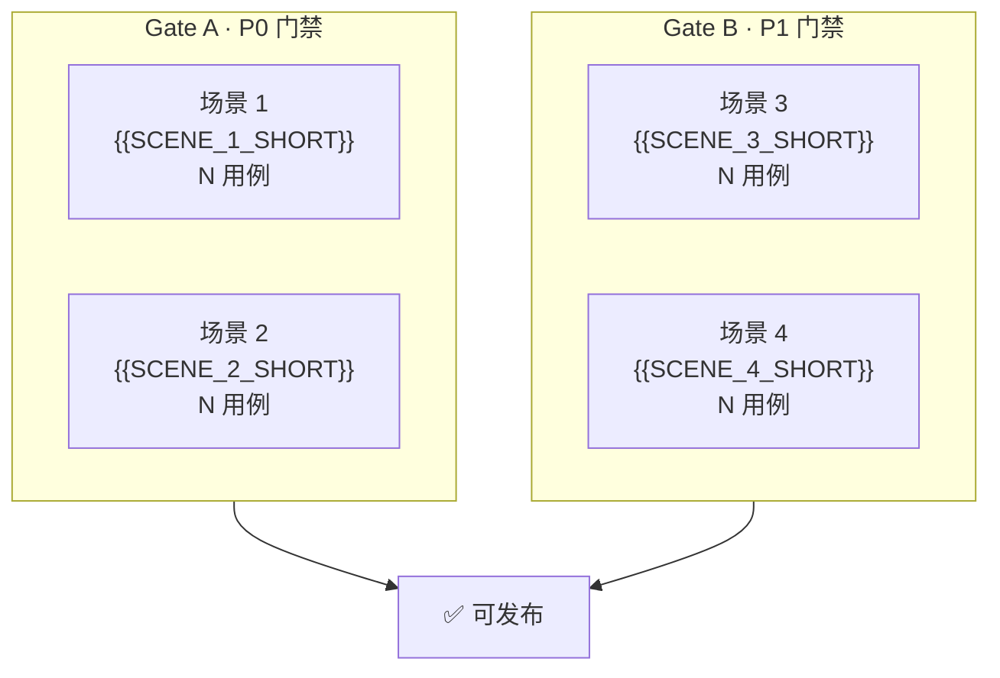
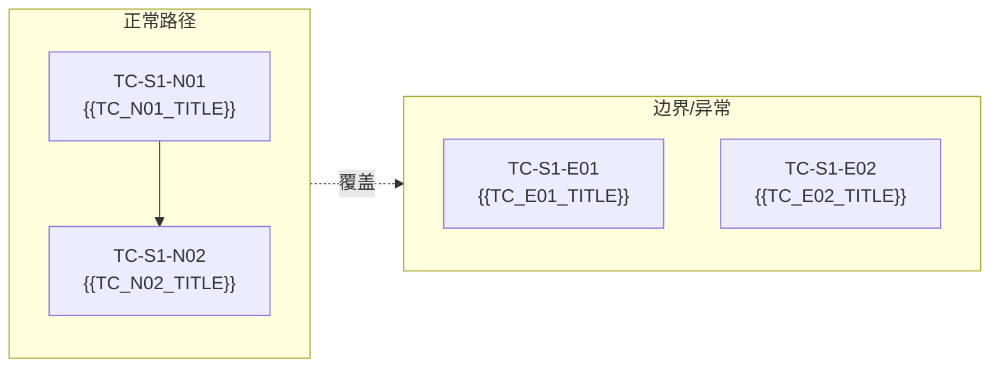
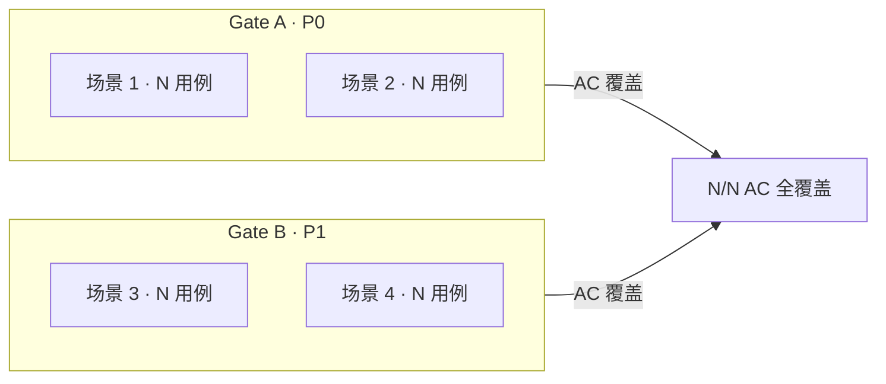

# 测试设计

> | v0.1.0 | {{DATE}} | {{AUTHOR}} | 📎 [CLAUDE.md](../../../CLAUDE.md) |

> **导航**: [← 技术评审](./技术评审.md) · [实施报告 →](./实施报告.md)
>
> **来源引用**：基于 [故事任务](./故事任务.md) §3 AC 与 [使用场景](./使用场景.md) §1 场景 1–N，一一对应。

---

[架构总览](#测试架构总览) · [§0 基线](#s-0-基线溯源){{TEST_SECTIONS_TOC}} · [§7 Gate](#s-7-gate-交接)

## 概述

基于故事任务 AC 与使用场景的测试用例集，N 场景四类用例（正常/边界/异常/回归），每用例 Given/When/Then 可独立执行。§7 定义 Gate A/B 交接信令。

### 主要价值

- 🎯 与使用场景一一对应 — N 组测试用例完整覆盖 N 个使用场景
- 🔒 异常路径可见 — 每场景含 API 失败、空状态、错误恢复用例
- ⚡ 每用例 Given/When/Then 可独立执行 — 不依赖上下文推断
- 🔗 双向跳转 — 每场景链接回使用场景，使用场景链接到此

---

## 测试架构总览

### 用例分布

- 🟢 **Gate A (P0) 正常路径**: N 用例 — [场景 1](#s-1-场景-1) M 例 · [场景 2](#s-2-场景-2) M 例
- 🔴 **Gate A (P0) 边界/异常**: N 用例
- 🔵 **Gate B (P1) 正常路径**: N 用例
- 🔵 **Gate B (P1) 边界/异常**: N 用例
- ✅ **AC 覆盖**: [N/N](./故事任务.md#s-3-ac)

---

## §0 基线溯源

| 使用场景 | 测试用例 | 覆盖 AC# |
|---------|---------|----------|
| [场景 1: {{SCENE_1_TITLE}}](./使用场景.md#场景-{{SCENE_1_SLUG}}) | [TC-S1-N01–N0N](#s-1-场景-1) · [TC-S1-E01–E0N](#s-1-场景-1) | [AC#](./故事任务.md#s-3-ac) |
| [场景 2: {{SCENE_2_TITLE}}](./使用场景.md#场景-{{SCENE_2_SLUG}}) | [TC-S2-N01–N0N](#s-2-场景-2) · [TC-S2-E01–E0N](#s-2-场景-2) | [AC#](./故事任务.md#s-3-ac) |

---

## §1 场景 1: {{SCENE_1_TITLE}}

> 📋 对应使用场景: [场景 1](./使用场景.md#场景-{{SCENE_1_SLUG}})
>
> 🎯 覆盖 AC: {{COVERED_AC_LIST}}

### 正常路径

#### TC-S1-N01: {{TC_N01_TITLE}}
- **Given**: {{TC_N01_GIVEN}}
- **When**: {{TC_N01_WHEN}}
- **Then**: {{TC_N01_THEN}}

#### TC-S1-N02: {{TC_N02_TITLE}}
- **Given**: {{TC_N02_GIVEN}}
- **When**: {{TC_N02_WHEN}}
- **Then**: {{TC_N02_THEN}}

### 边界/异常

#### TC-S1-E01: {{TC_E01_TITLE}}
- **Given**: {{TC_E01_GIVEN}}
- **When**: {{TC_E01_WHEN}}
- **Then**: {{TC_E01_THEN}}

#### TC-S1-E02: {{TC_E02_TITLE}}
- **Given**: {{TC_E02_GIVEN}}
- **When**: {{TC_E02_WHEN}}
- **Then**: {{TC_E02_THEN}}

---

<!-- 按需复制上述 §1 模板添加 §2 场景 2、§3 场景 3... -->

---

## §7 Gate 交接

### Gate A

- 🟢 **P0 正常路径** (N 用例): 覆盖 AC
- 🔴 **P0 异常** (N 用例): 覆盖 AC
- ✅ **AC 覆盖**: N/N，无遗漏
- 🚫 **阻塞问题**: 无

### Gate B

- 🔵 **P1 正常路径** (N 用例): 覆盖 AC
- 🔵 **P1 异常** (N 用例): 覆盖 AC
- ✅ **AC 覆盖**: N/N，无遗漏
- 🚫 **阻塞问题**: 无

---

> **变更记录**
> | 日期 | 变更 | 触发 | 证据 |
> |------|------|------|------|
> | {{DATE}} | 初始化 | 模板创建 | — |
