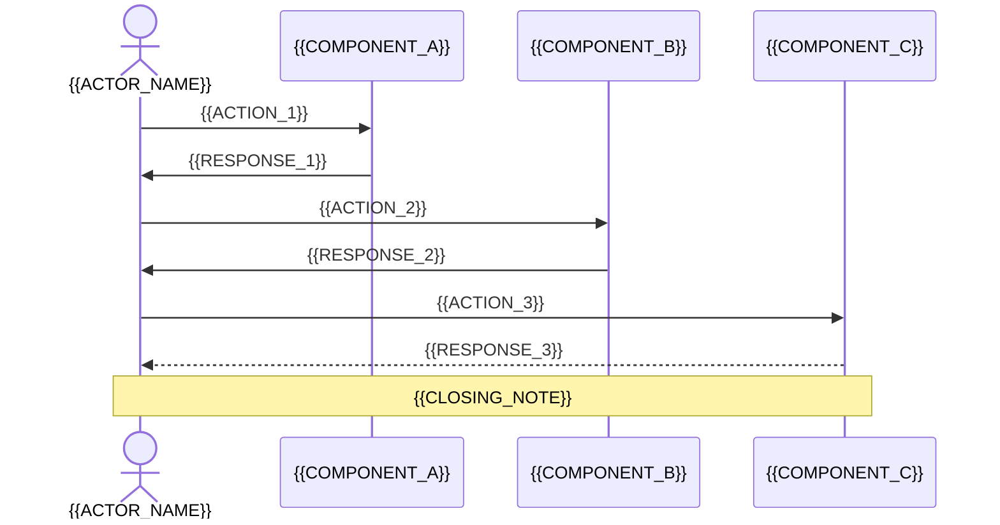

# 场景 {{N}}: {{SCENE_NAME}}

> | v{{VERSION}} | {{DATE}} | {{AUTHOR}} | 🌿 {{BRANCH}} | 📎 [CLAUDE.md](../../../CLAUDE.md) |
> **导航**: [← {{PREV_TITLE}}](./{{PREV_FILE}}) · [{{NEXT_TITLE}} →](./{{NEXT_FILE}})

[§0 技术评审](#sec0) · [§1 测试设计](#sec1) · [§2 实施报告](#sec2) · [§3 测试报告](#sec3) · [§4 自改进](#sec4)

## 概述

**角色**: {{SCENE_ROLE}} · **目标**: {{SCENE_GOAL}} · **优先级**: {{SCENE_PRIORITY}}

### 主要价值

- 🗺️ {{VALUE_1}}
- 🔗 {{VALUE_2}}
- 📋 {{VALUE_3}}
- 🚦 {{VALUE_4}}
- 🔄 {{VALUE_5}}

### 图谱定位

| 图层 | 本场景节点 | 上游 | 下游 |
|------|-----------|------|------|
| 领域层 | scene: {{SCENE_SLUG}} | story: {{STORY_NAME}} (contains) | maps_to → 结构层 |
| 结构层 | — | maps_to 来自领域层 | — |
| 内容层 | — | Read 来自结构层 | — |

---

## §0 技术评审

> 文档生成阶段填充（pm+coder）。

### 效果示意

```mermaid
%%{init: {'theme': 'base', 'themeVariables': {
  'primaryColor': '#1e1f2b',
  'primaryTextColor': '#a9b1d6',
  'primaryBorderColor': '#3d59a1',
  'lineColor': '#3d59a1',
  'secondaryColor': '#2b2d3b',
  'tertiaryColor': '#21232f'
}}}%%
flowchart LR
    Q["{{SCENE_ENTRY_QUESTION}}"]:::user --> S1["{{SCENE_STEP_1}}"]
    S1 --> S2["{{SCENE_STEP_2}}"]
    S2 --> S3["{{SCENE_STEP_3}}"]
    S3 --> S4["{{SCENE_STEP_4}}"]
    S4 --> R["{{SCENE_OUTCOME}}"]:::done

    classDef user fill:#3B82F6,color:#fff
    classDef done fill:#34d399,color:#000
```

### 情感目标

{{EMOTIONAL_GOAL}}

### 成功感知

{{SUCCESS_PERCEPTION}}

### 数据流全景

### 涉及模块

| 模块 | 职责 | 本场景角色 |
|------|------|-----------|
{{#each MODULES}}
| {{NAME}} | {{RESPONSIBILITY}} | {{SCENE_ROLE}} |
{{/each}}

### 基线溯源

| 本场景内容 | 基线来源 | 覆盖方式 | 状态 |
|-----------|---------|---------|------|
{{#each BASELINE_TRACE}}
| {{CONTENT}} | {{SOURCE}} | {{COVERAGE}} | {{STATUS}} |
{{/each}}

### 设计评审清单

| # | 检查项 | 状态 |
|---|--------|:--:|
{{#each DESIGN_CHECKLIST}}
| {{N}} | {{ITEM}} | |
{{/each}}

---

## §1 测试设计

> 文档生成阶段填充（tester）。

### 正常路径用例

| TC# | Given | When | Then | 覆盖 FP# | 优先级 |
|-----|-------|------|------|---------|--------|
{{#each TC_NORMAL}}
| TC-N{{N}} | {{GIVEN}} | {{WHEN}} | {{THEN}} | {{FP_REF}} | {{PRIORITY}} |
{{/each}}

### 边界/异常用例

| TC# | Given | When | Then | 覆盖 FP# | 优先级 |
|-----|-------|------|------|---------|--------|
{{#each TC_BOUNDARY}}
| TC-B{{N}} | {{GIVEN}} | {{WHEN}} | {{THEN}} | {{FP_REF}} | {{PRIORITY}} |
{{/each}}

### Gate A 交接

| 项目 | 状态 |
|------|:--:|
| 每 FP ≥3 类用例（含正常与边界） | {{GATE_A_TC_COVERAGE}} |
| {{GATE_A_CHECK_1}} | {{GATE_A_STATUS_1}} |
| {{GATE_A_CHECK_2}} | {{GATE_A_STATUS_2}} |
| {{GATE_A_CHECK_3}} | {{GATE_A_STATUS_3}} |
| Gate A 判定 | {{GATE_A_VERDICT}} |

---

## §2 实施报告

> 实现阶段填充（coder）。待实现。

### 操作步骤记录

| 步# | 时间 | 操作 | 文件/命令 | 结果 | 备注 |
|-----|------|------|----------|------|------|
| — | — | 待实现 | — | — | — |

### 开发源码清单

| 节点 ID | 文件路径 | 类型 | 行数 | 关键导出 | 逻辑摘要 |
|---------|---------|------|------|---------|---------|
| — | — | — | — | — | 待实现 |

### 测试源码清单

| 节点 ID | 文件路径 | 类型 | 行数 | 框架 | 覆盖节点 | 用例数 |
|---------|---------|------|------|------|---------|--------|
| — | — | — | — | — | — | 待实现 |

### 依赖图

> 待实现

### P0 审查表

| 模块 | P0 项 | 状态 | 修复 |
|------|-------|:--:|------|
| — | — | — | 待实现 |

### 效果验证

> 待实现

---

## §3 测试报告

> 验证阶段填充（tester）。待实现。

### 操作步骤记录

| 步# | 时间 | 操作 | 命令/文件 | 结果 | 备注 |
|-----|------|------|----------|------|------|
| — | — | 待实现 | — | — | — |

### 执行摘要

| 总用例 | 通过 | 失败 | 通过率 |
|--------|------|------|--------|
| — | — | — | 待实现 |

### 用例详情

| TC# | 结果 | 耗时 | 覆盖源文件:行号 |
|-----|------|------|---------------|
| — | — | — | 待实现 |

### 失败分析与修复

| 失败 TC# | 根因 | 修复 | 修复后 |
|----------|------|------|--------|
| — | — | — | 待实现 |

---

## §4 自改进

> 自改进阶段填充（self-improve）。待实现。

### D0–D7 诊断

| 诊断 | 触发? | 证据 | 提案 |
|------|-------|------|------|
| — | — | — | 待实现 |

### 改进清单

| # | 改进项 | 优先级 | 状态 |
|---|--------|--------|:--:|
| — | — | — | 待实现 |

### 评审清单

| # | 检查项 | 状态 |
|---|--------|:--:|
| — | — | 待实现 |

---

> **回溯链**
>
> - 需求来源：{{TRACE_REQUIREMENT}}
> - 基线内容：{{TRACE_BASELINE}}
> - 用户操作：{{TRACE_USER_OPS}}
> - 公式约束：遵循 [F.story.scene](../../../skills/rui/formulas.md#fstoryscene--场景-n-slugmd-meta--nav--0-技术评审--1-测试设计--2-实施报告--3-测试报告--4-自改进) 公式，含 §0–§4 全生命周期章节。
> - 证据级别：{{TRACE_EVIDENCE}}

### 变更记录

| 日期 | 版本 | 变更内容 | 触发 | 证据 |
|------|------|---------|------|------|
| {{DATE}} | {{VERSION}} | {{INIT_CHANGE}} | {{INIT_TRIGGER}} | {{INIT_EVIDENCE}} |
