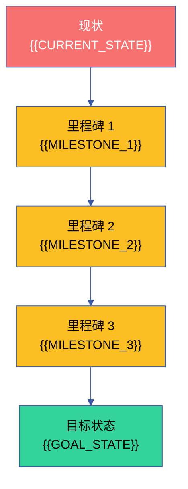
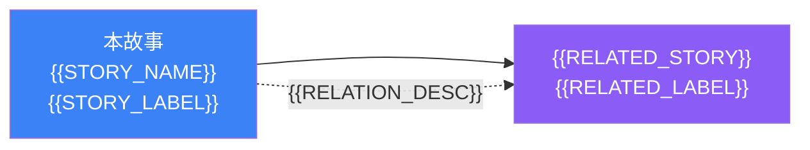

# 故事任务

> | v{{VERSION}} | {{DATE}} | {{AUTHOR}} | 🌿 {{BRANCH}} | 📎 [CLAUDE.md](../../../CLAUDE.md) |

## version_history

```json
[{"version":"{{VERSION}}","date":"{{DATE}}","trigger":"{{TRIGGER}}","change":"{{CHANGE_SUMMARY}}"}]
```

[§1 Story](#s-1-story) · [§7 跨文档索引](#s-7-跨文档索引) · [§R 关联故事](#s-r-关联故事) · [图谱定位](#图谱定位)

## 图谱定位

| 图层 | 本故事节点 | 上游 | 下游 |
|------|-----------|------|------|
| 领域层 | story: {{STORY_NAME}} | {{STORY_DOMAIN}} (part_of) | contains → {{SCENE_COUNT}}个场景 |
| 结构层 | {{STRUCTURE_DESC}} | 领域层 maps_to | 内容层 |
| 内容层 | 场景文档 · 审查报告 · 架构图 · 知识图谱 · 测试面板 · 计划清单 | 结构层 maps_to | — |

本故事在 {{PROJECT_NAME}} 技能拓扑中的位置：
- **上游依赖**: {{UPSTREAM_DEPS}}
- **下游消费者**: {{DOWNSTREAM_CONSUMERS}}
- **同级故事**: {{PEER_STORIES}}

## 概述

{{STORY_OVERVIEW}}

### 效果示意



### 主要价值

- 🎯 {{VALUE_PROP_1}}
- 🔗 {{VALUE_PROP_2}}
- 📊 {{VALUE_PROP_3}}
- 🔍 {{VALUE_PROP_4}}
- 🛡️ {{VALUE_PROP_5}}
- ♻️ {{VALUE_PROP_6}}

---

<a id="s-1-story"></a>
## §1 Story

{{#each STORIES}}
### Story {{N}}: {{TITLE}}

作为 {{ROLE}}，我想要 {{WANT}}，以便 {{SO_THAT}}。

优先级 **{{PRIORITY}}**。范围边界：{{SCOPE}}。依赖：{{DEPENDENCIES}}。

#### §1.1 User Operations

| # | 操作 | 触发条件 | 操作步骤 | 预期结果 |
|---|------|---------|---------|---------|
{{#each USER_OPS}}
| {{N}} | {{OP}} | {{TRIGGER}} | {{STEPS}} | {{EXPECTED}} |
{{/each}}

#### §2 Requirements

##### 功能点

| FP# | 描述 | 输入 | 输出 | 错误行为 | 优先级 |
|-----|------|------|------|---------|--------|
{{#each FP}}
| FP{{N}} | {{DESC}} | {{INPUT}} | {{OUTPUT}} | {{ERROR}} | {{PRIORITY}} |
{{/each}}

##### 业务规则

| R# | 描述 | 校验方式 | 证据级别 |
|----|------|---------|---------|
{{#each RULES}}
| R{{N}} | {{DESC}} | {{VERIFY}} | {{LEVEL}} |
{{/each}}

##### 数据约束

| 约束 | 类型 | 范围/格式 | 来源 |
|------|------|----------|------|
{{#each DATA_CONSTRAINTS}}
| {{NAME}} | {{TYPE}} | {{FORMAT}} | {{SOURCE}} |
{{/each}}

#### §3 成功标准

| SC# | 描述 | 度量方式 | 目标值 | 优先级 | 关联 FP# |
|-----|------|---------|--------|--------|---------|
{{#each SUCCESS_CRITERIA}}
| SC{{N}} | {{DESC}} | {{MEASURE}} | {{TARGET}} | {{PRIORITY}} | {{FP_REF}} |
{{/each}}

#### §4 范围边界

##### 范围内

| # | 条目 | 关联 FP# | 边界说明 |
|---|------|---------|---------|
{{#each IN_SCOPE}}
| {{N}} | {{ITEM}} | {{FP_REF}} | {{NOTE}} |
{{/each}}

##### 范围外

| # | 条目 | 排除原因 | 替代方案 |
|---|------|---------|---------|
{{#each OUT_SCOPE}}
| {{N}} | {{ITEM}} | {{REASON}} | {{ALTERNATIVE}} |
{{/each}}

#### §5 AC

| AC# | Given | When | Then | 门禁 |
|-----|-------|------|------|------|
{{#each ACCEPTANCE_CRITERIA}}
| AC{{N}} | {{GIVEN}} | {{WHEN}} | {{THEN}} | {{GATE}} |
{{/each}}

#### §6 风险与假设

| # | 风险/假设 | 类型 | 可能性 | 影响 | 缓解/验证策略 | 关联 FP# |
|---|----------|------|--------|------|-------------|---------|
{{#each RISKS}}
| {{N}} | {{DESC}} | {{TYPE}} | {{PROB}} | {{IMPACT}} | {{MITIGATION}} | {{FP_REF}} |
{{/each}}

---
{{/each}}

<a id="s-7-跨文档索引"></a>
## §7 跨文档索引

| 本文档章节 | 基线内容 | 下游文档编号 | 预期覆盖 | 状态 |
|-----------|---------|-------------|---------|------|
{{#each XREF}}
| {{CHAPTER}} | {{BASELINE}} | {{DOWNSTREAM}} | {{COVERAGE}} | {{STATUS}} |
{{/each}}

---

<a id="s-r-关联故事"></a>
## §R 关联故事



| 关联故事 | 关系类型 | 说明 |
|---------|---------|------|
{{#each RELATED_STORIES}}
| `{{NAME}}` | {{RELATION}} | {{DESC}} |
{{/each}}

---

> **回溯链**
>
> - 来源：{{TRACE_SOURCE}}
> - 能力规约：{{TRACE_SKILLS}}
> - 角色契约：{{TRACE_AGENTS}}
> - 治理约束：{{TRACE_RULES}}
> - 文档公式：[公式规约](../../../skills/rui/formulas.md) — 定义故事文档的结构化产出规范
>
> **证据标注说明**：{{EVIDENCE_NOTE}}

### 变更记录

| 日期 | 版本 | 变更内容 | 触发 | 证据 |
|------|------|---------|------|------|
| {{DATE}} | {{VERSION}} | {{INIT_CHANGE}} | {{INIT_TRIGGER}} | {{INIT_EVIDENCE}} |

---

> **导航**: [场景-1-模块定位 →](./场景-1-{{SCENE_1_SLUG}}/index.md)
