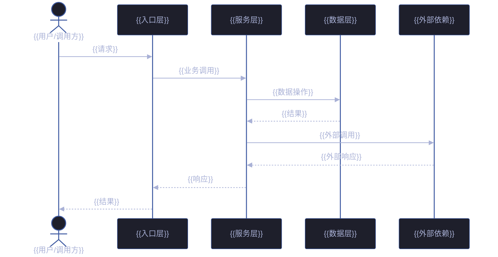
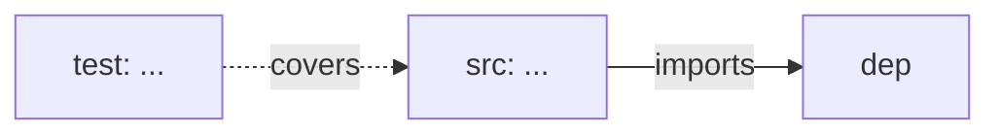

# 场景 {{N}}: {{NAME}}

> | v{{VERSION}} | {{DATE}} | {{AUTHOR}} | 📎 [CLAUDE.md](../../../CLAUDE.md) |
> **导航**: [← 场景-{{N-1}}](./场景-{{N-1}}-xxx.md) · [后继 →](./场景-{{N+1}}-xxx.md)

[§0 技术评审](#sec0) · [§1 测试设计](#sec1) · [§2 实施报告](#sec2) · [§3 测试报告](#sec3) · [§4 自改进](#sec4)

## 概述

**角色**: {{ROLE}} · **目标**: {{GOAL}} · **优先级**: {{PRIORITY}}

> 本场景聚焦 **数据流与 API 设计**：端到端数据通路、接口契约、状态流转、错误传播。

### 图谱定位

| 图层 | 本场景节点 | 上游 | 下游 |
|------|-----------|------|------|
| 领域层 | scene: {{N}} | story: {{STORY_NAME}} (contains) | maps_to → 结构层 |
| 结构层 | src: ... / test: ... | maps_to 来自领域层 | verifies · Read → 内容层 |
| 内容层 | Read/Grep 获取 | Read 来自结构层 | — |

---

<a id="sec0"></a>
## §0 技术评审

> 数据流与 API 设计场景。聚焦端到端数据通路、请求/响应契约、状态机与错误传播。

### 数据流全景



### API 端点

| 方法 | 路径 | 用途 | 请求体 | 响应体 | 错误码 |
|------|------|------|--------|--------|--------|
| GET | `/api/{{resource}}` | {{用途}} | — | `{ "items": [...], "total": N }` | 401, 403 |
| POST | `/api/{{resource}}` | {{用途}} | `{ "field": "value" }` | `{ "id": "...", ... }` | 400, 401, 422 |
| PUT | `/api/{{resource}}/:id` | {{用途}} | `{ "field": "updated" }` | `{ "id": "...", ... }` | 400, 401, 404 |
| DELETE | `/api/{{resource}}/:id` | {{用途}} | — | `{ "deleted": true }` | 401, 404 |

### curl 命令

```bash
# GET /api/{{resource}} — {{用途}}
curl -s -w "\n%{http_code}" \
  -X GET \
  "${BASE_URL}/api/{{resource}}" \
  -H "Authorization: Bearer ${API_X_TOKEN}"

# 预期响应: HTTP 200
# { "items": [...], "total": N }

# POST /api/{{resource}} — {{用途}}
curl -s -w "\n%{http_code}" \
  -X POST \
  "${BASE_URL}/api/{{resource}}" \
  -H "Content-Type: application/json" \
  -H "Authorization: Bearer ${API_X_TOKEN}" \
  -d '{"{{field}}":"{{value}}"}'

# 预期响应: HTTP 201
# { "id": "...", "{{field}}": "{{value}}" }
```

### 状态流转

```mermaid
stateDiagram-v2
    [*] --> {{初始态}}: 资源创建

    {{初始态}} --> {{校验态}}: {{触发动作}}
    {{校验态}} --> {{处理态}}: 校验通过
    {{校验态}} --> {{终态-拒绝}}: {{校验失败条件}}

    {{处理态}} --> {{终态-成功}}: {{完成动作}}
    {{处理态}} --> {{重试态}}: {{失败条件}}
    {{重试态}} --> {{处理态}}: {{重试}}(≤ {{MAX_RETRIES}}/次)
    {{重试态}} --> {{终态-失败}}: 重试耗尽
    {{处理态}} --> {{终态-失败}}: {{致命错误条件}}

    {{初始态}} --> {{终态-取消}}: 取消
    {{校验态}} --> {{终态-取消}}: 取消
    {{处理态}} --> {{终态-取消}}: 取消

    {{终态-成功}} --> [*]
    {{终态-拒绝}} --> [*]
    {{终态-失败}} --> [*]
    {{终态-取消}} --> [*]
```

| 状态 | 允许迁移 | 禁止迁移 | 禁止原因 |
|------|---------|---------|---------|
| {{初始态}} | → {{校验态}} · {{终态-取消}} | → {{终态-成功}} | 未经处理不可直接完成 |
| {{校验态}} | → {{处理态}} · {{终态-拒绝}} · {{终态-取消}} | → {{终态-成功}} | 校验未通过不可完成 |
| {{处理态}} | → {{终态-成功}} · {{重试态}} · {{终态-失败}} · {{终态-取消}} | → {{终态-拒绝}} · {{初始态}} | 校验已过不可回退 |
| {{重试态}} | → {{处理态}} · {{终态-失败}} | → {{终态-成功}} | 未完成处理不可成功 |
| {{终态-*}} | → [*]（仅终态出口） | → 任意非终态 | 终态不可逆 |

### 涉及模块

| 模块 | 路径 | 职责 | 本场景角色 |
|------|------|------|-----------|
| {{模块1}} | `{{path/to/module}}` | {{职责描述}} | {{数据流中的角色}} |

### 设计评审清单

| # | 检查项 | 状态 |
|---|--------|:--:|
| 1 | 数据流序列图覆盖主路径 + 异常路径 | |
| 2 | 每 API 含完整 curl + 预期响应 + 错误码 | |
| 3 | 状态机覆盖全部合法迁移 + 非法迁移拒绝 | |
| 4 | 错误传播路径明确（谁创建、谁传递、谁处理） | |

---

<a id="sec1"></a>
## §1 测试设计

> API 契约测试 + 数据流集成测试。

### 正常路径用例

| TC# | Given | When | Then | 覆盖 FP# | 优先级 |
|-----|-------|------|------|---------|--------|

### 边界/异常用例

| TC# | Given | When | Then | 覆盖 FP# | 优先级 |
|-----|-------|------|------|---------|--------|

### Gate A 交接

| 项目 | 状态 |
|------|:--:|
| 每 API 端点 ≥3 类用例（正常/边界/异常） | |
| 状态机每条迁移路径有对应用例 | |
| Gate A 判定 | |

---

<a id="sec2"></a>
## §2 实施报告

> 实现阶段填充（coder）。

### 操作步骤记录

| 步# | 时间 | 操作 | 文件/命令 | 结果 | 备注 |
|-----|------|------|----------|------|------|
| 2 | HH:MM | 读设计文档 | `Read <path>` | ✓ | |
| 3 | HH:MM | 实现 API 端点 | `Edit/Write <file>` | ✓/✗ | |

### 开发源码清单

| 节点 ID | 文件路径 | 类型 | 行数 | 关键导出 | 逻辑摘要 |
|---------|---------|------|------|---------|---------|

### 测试源码清单

| 节点 ID | 文件路径 | 类型 | 行数 | 框架 | 覆盖节点 | 用例数 |
|---------|---------|------|------|------|---------|--------|

### 依赖图



### P0 审查表

| 模块 | P0 项 | 状态 | 修复 |
|------|-------|:--:|------|

### 效果验证

```bash
# {{METHOD}} {{/api/path}} — 验证 {{场景名}}
curl -s -w "\n%{http_code}" \
  -X {{METHOD}} \
  "${BASE_URL}/api/{{path}}" \
  -H "Content-Type: application/json" \
  -H "Authorization: Bearer ${API_X_TOKEN}" \
  -d '{"{{field}}":"{{value}}"}'

# 预期: HTTP {{STATUS}}
```

---

<a id="sec3"></a>
## §3 测试报告

> 验证阶段填充（tester）。

### 操作步骤记录

| 步# | 时间 | 操作 | 命令/文件 | 结果 | 备注 |
|-----|------|------|----------|------|------|

### 执行摘要

| 总用例 | 通过 | 失败 | 通过率 |
|--------|------|------|--------|

### 用例详情

| TC# | 结果 | 耗时 | 覆盖源文件:行号 |
|-----|------|------|---------------|

### 失败分析与修复

| 失败 TC# | 根因 | 修复 | 修复后 |
|----------|------|------|--------|

---

<a id="sec4"></a>
## §4 自改进

> 自改进阶段填充（self-improve）。

### D0–D7 诊断

| 诊断 | 触发? | 证据 | 提案 |
|------|-------|------|------|

### 改进清单

| # | 改进项 | 优先级 | 状态 |
|---|--------|--------|:--:|

### 评审清单

| # | 检查项 | 状态 |
|---|--------|:--:|
