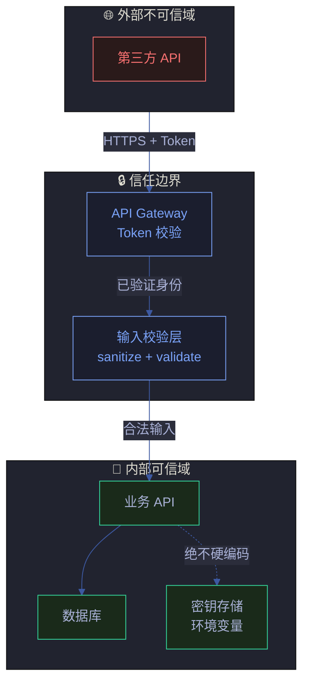
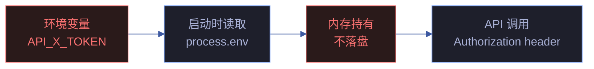
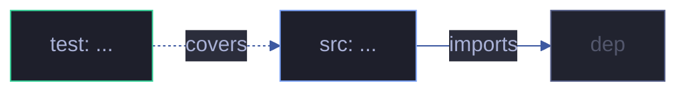

# 场景 {{N}}: {{NAME}}

> | v{{VERSION}} | {{DATE}} | {{AUTHOR}} | 📎 [CLAUDE.md](../../../CLAUDE.md) |
> **导航**: [← 场景-{{N-1}}](./场景-{{N-1}}-xxx.md) · [后继 →](./场景-{{N+1}}-xxx.md)

[§0 技术评审](#sec0) · [§1 测试设计](#sec1) · [§2 实施报告](#sec2) · [§3 测试报告](#sec3) · [§4 自改进](#sec4)

## 概述

**角色**: {{ROLE}} · **目标**: {{GOAL}} · **优先级**: {{PRIORITY}}

> 本场景聚焦 **信任边界与安全面**：认证授权、输入校验、密钥管理、敏感数据处理。

### 图谱定位

| 图层 | 本场景节点 | 上游 | 下游 |
|------|-----------|------|------|
| 领域层 | scene: {{N}} | story: {{STORY_NAME}} (contains) | maps_to → 结构层 |
| 结构层 | src: ... / test: ... | maps_to 来自领域层 | verifies · Read → 内容层 |
| 内容层 | Read/Grep 获取 | Read 来自结构层 | — |

### 每场景交付物

| 文件 | 填充阶段 | 填充者 |
|------|---------|--------|
| `计划清单.html` | 实施规划 | planner |
| `架构图.html` | 技术评审 | architect |
| `知识图谱.html` | 文档基线 | pm |
| `测试面板.html` | 测试设计 + 测试报告 | tester |
| `交互示例.html` | 实施报告 | coder |
| `知识图谱.json` | 文档基线 | pm |

---

<a id="sec0"></a>
## §0 技术评审

> 安全面独立审计。聚焦认证链路、授权边界、输入校验、密钥与敏感数据保护。

### 信任边界



### 认证与授权

| 资源 | 认证方式 | 授权要求 | 绕过后果 | 校验点 |
|------|---------|---------|---------|--------|
| {{资源1}} | Bearer Token | {{角色}} | {{风险}} | {{中间件/守卫}} |

### 输入校验矩阵

| 输入点 | 类型 | 校验规则 | sanitize | 错误返回 |
|--------|------|---------|-----------|---------|
| {{字段1}} | string | `^[a-z0-9-]+$`, max 255 | trim, escape | 400 Bad Request |
| {{字段2}} | number | ≥ 0, ≤ MAX_SAFE_INTEGER | — | 422 Unprocessable |

### 敏感数据流



| 数据 | 分类 | 存储 | 传输 | 日志 |
|------|------|------|------|------|
| API_X_TOKEN | 密钥 | 仅环境变量 | HTTPS Header | 禁止 🚫 |
| {{用户凭证}} | 敏感 | 哈希存储 | HTTPS Body | 禁止 🚫 |
| {{用户输入}} | 需校验 | — | HTTPS | 脱敏后允许 |

### 涉及模块

| 模块 | 路径 | 职责 | 本场景角色 |
|------|------|------|-----------|
| 认证中间件 | `{{path}}` | token 校验 | 信任边界入口 |

### 设计评审清单

| # | 检查项 | 状态 |
|---|--------|:--:|
| 1 | 所有入口有认证校验，无绕过路径 | |
| 2 | 用户输入全部经过 validate + sanitize | |
| 3 | 密钥不落盘，仅通过环境变量传入 | |
| 4 | 敏感数据不出现于日志/错误消息 | |

---

<a id="sec1"></a>
## §1 测试设计

> 安全测试：认证绕过、注入攻击、权限提升、密钥泄露。

### 正常路径用例

| TC# | Given | When | Then | 覆盖 FP# | 优先级 |
|-----|-------|------|------|---------|--------|

### 边界/异常用例

| TC# | Given | When | Then | 覆盖 FP# | 优先级 |
|-----|-------|------|------|---------|--------|
| TC-SEC1 | 无有效 token | 请求受保护资源 | 401 Unauthorized | | P0 |
| TC-SEC2 | 含恶意输入（XSS/SQL 注入） | 提交到输入点 | 400/422，无数据泄露 | | P0 |
| TC-SEC3 | 低权限用户 | 请求高权限资源 | 403 Forbidden | | P0 |

### Gate A 交接

| 项目 | 状态 |
|------|:--:|
| 每信任边界点 ≥3 类安全用例 | |
| 输入校验覆盖全部入口 | |
| Gate A 判定 | |

---

<a id="sec2"></a>
## §2 实施报告

> 实现阶段填充（coder + planner）。

### 实施计划

> planner 生成 → 见 `场景-{{N}}-<slug>/计划清单.html`

### 操作步骤记录

| 步# | 时间 | 操作 | 文件/命令 | 结果 | 备注 |
|-----|------|------|----------|------|------|
| 1 | HH:MM | 读计划清单 | `Read 计划清单.html` | ✓ | |
| 2 | HH:MM | 读安全设计 | `Read <path>` | ✓ | |

### 开发源码清单

| 节点 ID | 文件路径 | 类型 | 行数 | 关键导出 | 逻辑摘要 |
|---------|---------|------|------|---------|---------|

### 测试源码清单

| 节点 ID | 文件路径 | 类型 | 行数 | 框架 | 覆盖节点 | 用例数 |
|---------|---------|------|------|------|---------|--------|

### 依赖图



### P0 审查表

| 模块 | P0 项 | 状态 | 修复 |
|------|-------|:--:|------|

### 效果验证

> 安全验证：逐项验证认证/授权/输入校验/密钥保护。

```bash
# 验证认证不可绕过 — 无 token 请求
curl -s -w "\n%{http_code}" -X GET "${BASE_URL}/api/{{protected}}" 
# 预期: HTTP 401

# 验证输入校验 — XSS 注入尝试
curl -s -w "\n%{http_code}" \
  -X POST "${BASE_URL}/api/{{resource}}" \
  -H "Content-Type: application/json" \
  -H "Authorization: Bearer ${API_X_TOKEN}" \
  -d '{"field":"<script>alert(1)</script>"}'
# 预期: HTTP 400
```

---

<a id="sec3"></a>
## §3 测试报告

> 验证阶段填充（tester）。

### 操作步骤记录

| 步# | 时间 | 操作 | 命令/文件 | 结果 | 备注 |
|-----|------|------|----------|------|------|

### 执行摘要

| 总用例 | 通过 | 失败 | 通过率 |
|--------|------|------|--------|

### 用例详情

| TC# | 结果 | 耗时 | 覆盖源文件:行号 |
|-----|------|------|---------------|

### 失败分析与修复

| 失败 TC# | 根因 | 修复 | 修复后 |
|----------|------|------|--------|

---

<a id="sec4"></a>
## §4 自改进

> 自改进阶段填充（self-improve）。

### D0–D7 诊断

| 诊断 | 触发? | 证据 | 提案 |
|------|-------|------|------|

### 改进清单

| # | 改进项 | 优先级 | 状态 |
|---|--------|--------|:--:|

### 评审清单

| # | 检查项 | 状态 |
|---|--------|:--:|
