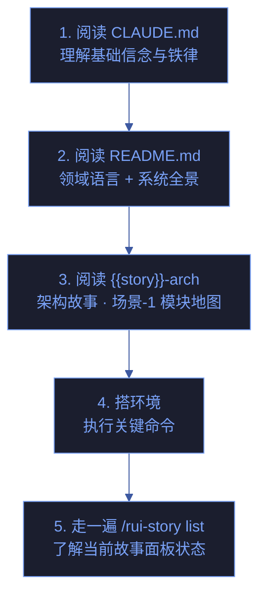
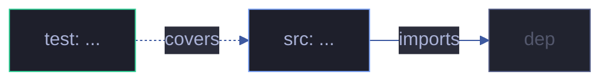

# 场景 {{N}}: {{NAME}}

> | v{{VERSION}} | {{DATE}} | {{AUTHOR}} | 📎 [CLAUDE.md](../../../CLAUDE.md) |
> **导航**: [← 场景-{{N-1}}](./场景-{{N-1}}-xxx.md) · [← 故事任务](./故事任务.md)

[§0 技术评审](#sec0) · [§1 测试设计](#sec1) · [§2 实施报告](#sec2) · [§3 测试报告](#sec3) · [§4 自改进](#sec4)

## 概述

**角色**: {{ROLE}} · **目标**: {{GOAL}} · **优先级**: {{PRIORITY}}

> 本场景聚焦 **运行与上手**：开发环境搭建、构建部署、监控告警、新人 onboarding 路径。

### 图谱定位

| 图层 | 本场景节点 | 上游 | 下游 |
|------|-----------|------|------|
| 领域层 | scene: {{N}} | story: {{STORY_NAME}} (contains) | maps_to → 结构层 |
| 结构层 | src: ... / test: ... | maps_to 来自领域层 | verifies · Read → 内容层 |
| 内容层 | Read/Grep 获取 | Read 来自结构层 | — |

### 每场景交付物

| 文件 | 填充阶段 | 填充者 |
|------|---------|--------|
| `计划清单.html` | 实施规划 | planner |
| `架构图.html` | 技术评审 | architect |
| `知识图谱.html` | 文档基线 | pm |
| `测试面板.html` | 测试设计 + 测试报告 | tester |
| `交互示例.html` | 实施报告 | coder |
| `知识图谱.json` | 文档基线 | pm |

---

<a id="sec0"></a>
## §0 技术评审

> 运行与上手场景。聚焦构建部署流程、环境配置、监控指标、新人开发指南。

### 构建与部署流


### 环境配置

| 环境变量 | 用途 | 默认值 | 必填 |
|----------|------|--------|:---:|
| `API_X_TOKEN` | 远端 API 认证 | — | ✓ |
| `{{VAR_NAME}}` | {{用途}} | {{默认}} | ✓/✗ |

### 关键命令

```bash
# 开发
{{开发启动命令}}

# 构建
{{构建命令}}

# 测试
node tests/run.mjs

# 部署
{{部署命令}}
```

### 监控与告警

| 指标 | 含义 | 采集方式 | 告警阈值 |
|------|------|---------|---------|
| {{指标1}} | {{含义}} | {{采集方式}} | {{阈值}} |

### 新人上手路径



### 涉及模块

| 模块 | 路径 | 职责 | 本场景角色 |
|------|------|------|-----------|
| {{配置文件}} | `{{path}}` | {{职责}} | 构建/部署入口 |

### 设计评审清单

| # | 检查项 | 状态 |
|---|--------|:--:|
| 1 | 构建/部署流完整可执行 | |
| 2 | 环境变量全部文档化 | |
| 3 | 监控指标覆盖关键路径 | |
| 4 | 新人上手路径 ≤5 步可完成首次运行 | |

---

<a id="sec1"></a>
## §1 测试设计

> 环境验证 + 构建完整性 + 部署冒烟测试。

### 正常路径用例

| TC# | Given | When | Then | 覆盖 FP# | 优先级 |
|-----|-------|------|------|---------|--------|

### 边界/异常用例

| TC# | Given | When | Then | 覆盖 FP# | 优先级 |
|-----|-------|------|------|---------|--------|
| TC-OPS1 | 缺失必填环境变量 | 启动应用 | 明确错误提示，非静默失败 | | P0 |
| TC-OPS2 | 构建产物不完整 | 执行部署 | 构建失败并报告缺失项 | | P0 |

### Gate A 交接

| 项目 | 状态 |
|------|:--:|
| 环境验证用例覆盖全部必填变量 | |
| 构建/部署流程有冒烟测试 | |
| Gate A 判定 | |

---

<a id="sec2"></a>
## §2 实施报告

> 实现阶段填充（coder + planner）。

### 实施计划

> planner 生成 → 见 `场景-{{N}}-<slug>/计划清单.html`

### 操作步骤记录

| 步# | 时间 | 操作 | 文件/命令 | 结果 | 备注 |
|-----|------|------|----------|------|------|
| 1 | HH:MM | 读计划清单 | `Read 计划清单.html` | ✓ | |
| 2 | HH:MM | 读环境配置 | `Read <path>` | ✓ | |

### 开发源码清单

| 节点 ID | 文件路径 | 类型 | 行数 | 关键导出 | 逻辑摘要 |
|---------|---------|------|------|---------|---------|

### 测试源码清单

| 节点 ID | 文件路径 | 类型 | 行数 | 框架 | 覆盖节点 | 用例数 |
|---------|---------|------|------|------|---------|--------|

### 依赖图



### P0 审查表

| 模块 | P0 项 | 状态 | 修复 |
|------|-------|:--:|------|

### 效果验证

> 构建成功 + 部署冒烟通过 + 新人可完成上手步骤。

```bash
# 验证环境配置
echo ${API_X_TOKEN:?"API_X_TOKEN not set"}

# 验证测试全部通过
node tests/run.mjs
```

---

<a id="sec3"></a>
## §3 测试报告

> 验证阶段填充（tester）。

### 操作步骤记录

| 步# | 时间 | 操作 | 命令/文件 | 结果 | 备注 |
|-----|------|------|----------|------|------|

### 执行摘要

| 总用例 | 通过 | 失败 | 通过率 |
|--------|------|------|--------|

### 用例详情

| TC# | 结果 | 耗时 | 覆盖源文件:行号 |
|-----|------|------|---------------|

### 失败分析与修复

| 失败 TC# | 根因 | 修复 | 修复后 |
|----------|------|------|--------|

---

<a id="sec4"></a>
## §4 自改进

> 自改进阶段填充（self-improve）。

### D0–D7 诊断

| 诊断 | 触发? | 证据 | 提案 |
|------|-------|------|------|

### 改进清单

| # | 改进项 | 优先级 | 状态 |
|---|--------|--------|:--:|

### 评审清单

| # | 检查项 | 状态 |
|---|--------|:--:|
