# 故事任务

> | v0.1.0 | {{DATE}} | {{AUTHOR}} | 📎 [CLAUDE.md](../../../CLAUDE.md) |
> **导航**: [场景-1 →](./场景-1-<slug>.md)

[概述](#概述) · [§1 Story](#s-1-story){{STORY_TOC}} · [§2 范围边界](#s-2-范围边界) · [§3 AC](#s-3-ac) · [§4 风险与假设](#s-4-风险与假设)

## 概述

{{MODULE_DESCRIPTION}}

面向的用户角色：{{USER_ROLES}}。

**数据来源**：{{DATA_SOURCE_EXPLANATION}}

### 管线架构

```mermaid
%%{init: {'theme': 'base', 'themeVariables': {
  'primaryColor': '#1e1f2b',
  'primaryTextColor': '#a9b1d6',
  'primaryBorderColor': '#3d59a1',
  'lineColor': '#3d59a1',
  'secondaryColor': '#2b2d3b',
  'tertiaryColor': '#21232f'
}}}%%
flowchart LR
    A["故事定义<br/>pm"]:::core --> B["文档基线<br/>architect + security"]:::review
    B --> C["实施计划<br/>planner"]:::exec
    C --> D["代码实现<br/>coder"]:::exec
    D --> E["测试验证<br/>tester"]:::review
    E --> F["代码审查<br/>code-reviewer"]:::review
    F --> G["交付收口<br/>reporter"]:::exec
    G --> H["自改进<br/>self-improve"]:::cross

    classDef core fill:#1b1e2e,stroke:#7aa2f7,color:#7aa2f7
    classDef exec fill:#1e1f2b,stroke:#565f89,color:#a9b1d6
    classDef review fill:#1e1f2b,stroke:#7aa2f7,color:#a9b1d6
    classDef cross fill:#21232f,stroke:#565f89,color:#a9b1d6
```

| 阶段 | Agent | 产出 |
|------|-------|------|
| 故事定义 | pm | 故事任务.md |
| 文档基线 | architect + security | 场景-N-<slug>.md × 4-5 |
| 实施计划 | **planner** | 计划清单.html（每场景） |
| 代码实现 | coder | 源码 + P0 审查 |
| 测试验证 | tester | 测试报告 |
| 代码审查 | code-reviewer | 审查结论 |
| 交付收口 | reporter | 日志 · 文档同步 · 通知 |
| 自改进 | self-improve | D0-D7 诊断 · 改进提案 |

### 主要价值

- 🔍 **{{VALUE_PROP_1}}** — {{VALUE_PROP_1_DESC}}
- 💬 **{{VALUE_PROP_2}}** — {{VALUE_PROP_2_DESC}}
- 🏷️ **{{VALUE_PROP_3}}** — {{VALUE_PROP_3_DESC}}
- 🚫 **明确的不做清单** — {{OUT_OF_SCOPE_SUMMARY}}，保持产品边界清晰

### 每场景交付物

> 每场景目录 `场景-N-<slug>/` 下必须包含 5 个 HTML 文件 + 1 个 JSON：

| 文件 | 填充阶段 | 说明 |
|------|---------|------|
| `计划清单.html` | planner | 实施计划，每步 2-5 分钟可完成 |
| `架构图.html` | architect | 模块拓扑 · 数据流 · 决策点 |
| `知识图谱.html` | pm + architect | 场景节点与边可视化 |
| `测试面板.html` | tester | 测试用例通过/失败/待执行 |
| `交互示例.html` | coder | 操作步骤 + 可复制命令 + 预期输出 |
| `知识图谱.json` | pm | 场景结构化数据（节点 · 边 · 图层） |

---

## §1 Story

### Story 1: {{STORY_1_TITLE}}

作为 {{ROLE_1}}，我想要 {{GOAL_1}}，以便 {{BENEFIT_1}}。优先级 {{PRIORITY_1}}。

#### 功能点与约束

| 类别 | 描述 | 输入/约束 | 输出/校验 | 错误/说明 | 优先级/级别 |
|------|------|----------|----------|----------|------------|
| 功能点 | {{FP1_DESC}} | {{FP1_INPUT}} | {{FP1_OUTPUT}} | {{FP1_ERROR}} | {{FP1_PRIORITY}} |
| 功能点 | {{FP2_DESC}} | {{FP2_INPUT}} | {{FP2_OUTPUT}} | {{FP2_ERROR}} | {{FP2_PRIORITY}} |
| 业务规则 | {{BR1_DESC}} | — | 手动验收：{{BR1_ACCEPTANCE}} | {{BR1_LEVEL}} | — |
<!--
  ⚠️ 数据约束填写指南：
  每行描述一个故事涉及的数据实体，覆盖该 Story 全部输入/输出数据的类型、格式、取值范围与错误行为。
  常见约束类型：
  - 自由文本：用户输入的字符串，需注明去空格/长度限制/匹配范围
  - 枚举：限定取值集合，需列出全部有效值及兜底策略
  - 正则：结构化标识符（如 kebab-case、文件路径），附正则表达式
  - 文件格式：导入/导出文件的格式约束（如 ZIP、JSON）
  - 数组/集合：多选场景的元素类型与唯一性约束
  原则：每个故事的数据约束行数应 ≥ 该故事涉及的数据实体数，确保全覆盖无遗漏。
-->
| 数据约束 | {{DC1_IDENTIFIER}} | 正则 | {{DC1_PATTERN}} | {{DC1_ERROR}} | — |
| 数据约束 | {{DC2_USER_INPUT}} | 自由文本 | {{DC2_CONSTRAINT}} | {{DC2_ERROR}} | — |
| 数据约束 | {{DC3_ENUM_VALUE}} | 枚举 | {{DC3_VALUES}} | {{DC3_ERROR}} | — |
| 数据约束 | {{DC4_FILE_FORMAT}} | 文件格式 | {{DC4_FORMAT}} | {{DC4_ERROR}} | — |

#### 成功标准

- 🎯 **{{SC1_TITLE}}** — 度量：{{SC1_METRIC}} · 目标：{{SC1_TARGET}} · {{SC1_PRIORITY}}
- ✅ **{{SC2_TITLE}}** — 度量：{{SC2_METRIC}} · 目标：{{SC2_TARGET}} · {{SC2_PRIORITY}}

#### §1.1 User Operations

| 操作 | 触发条件 | 操作步骤 | 预期结果 |
|------|---------|---------|---------|
| {{UO1_ACTION}} | {{UO1_TRIGGER}} | {{UO1_STEPS}} | {{UO1_RESULT}} |
| {{UO2_ACTION}} | {{UO2_TRIGGER}} | {{UO2_STEPS}} | {{UO2_RESULT}} |

#### 范围边界

**范围内**：{{STORY1_IN_SCOPE}}。**范围外**：{{STORY1_OUT_SCOPE}}。

---

<!-- 按需复制上述 Story 模板添加 Story 2、Story 3... -->

---

## §2 范围边界

### 范围内（做什么）

| 条目 | 关联 FP# | 产品决策依据 |
|------|---------|-------------|
| {{IN_SCOPE_1}} | {{IN_SCOPE_1_FP}} | {{IN_SCOPE_1_REASON}} |
| {{IN_SCOPE_2}} | {{IN_SCOPE_2_FP}} | {{IN_SCOPE_2_REASON}} |

### 范围外（不做什么）

| 条目 | 排除原因 | 产品决策 |
|------|---------|---------|
| **{{OUT_SCOPE_1}}** | {{OUT_SCOPE_1_REASON}} | {{OUT_SCOPE_1_DECISION}} |
| **{{OUT_SCOPE_2}}** | {{OUT_SCOPE_2_REASON}} | {{OUT_SCOPE_2_DECISION}} |

---

## §3 AC

| Given | When | Then |
|-------|------|------|
| {{AC1_GIVEN}} | {{AC1_WHEN}} | {{AC1_THEN}} |
| {{AC2_GIVEN}} | {{AC2_WHEN}} | {{AC2_THEN}} |

---

## §4 风险与假设

### 风险

- ⚠️ **{{RISK_1}}** — 可能性：{{RISK_1_LIKELIHOOD}} · 影响：{{RISK_1_IMPACT}} · 缓解：{{RISK_1_MITIGATION}}
- ⚠️ **{{RISK_2}}** — 可能性：{{RISK_2_LIKELIHOOD}} · 影响：{{RISK_2_IMPACT}} · 缓解：{{RISK_2_MITIGATION}}

### 假设

- 💡 **{{ASSUMPTION_1}}** — {{ASSUMPTION_1_NOTE}}
- 💡 **{{ASSUMPTION_2}}** — {{ASSUMPTION_2_NOTE}}

---

> **回溯链**：[场景-1](./场景-1-<slug>.md)

### 变更记录

| 日期 | 版本 | 变更内容 |
|------|------|---------|
| {{DATE}} | 0.1.0 | 初始化，从模板创建 |
